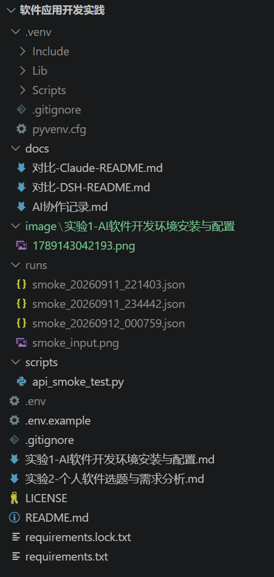
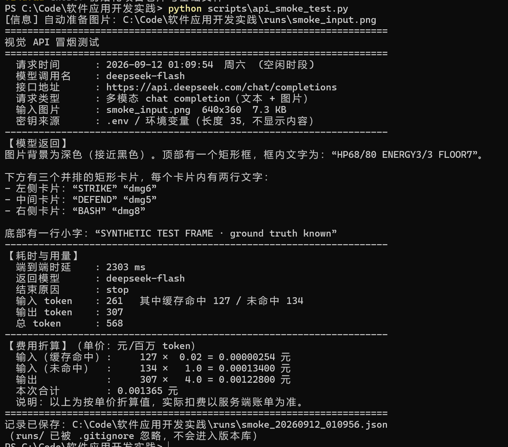
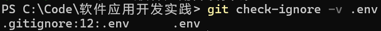
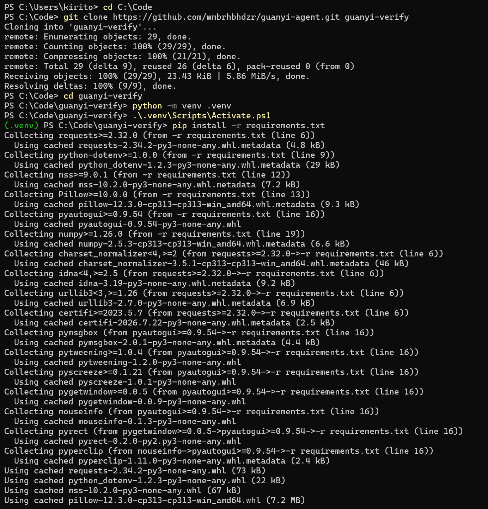
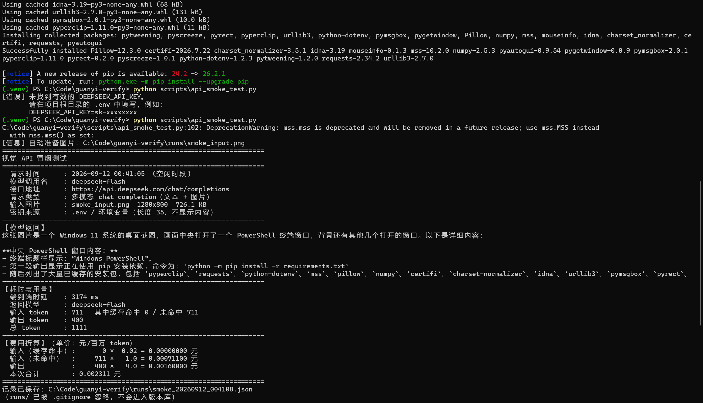

# 实验1：AI软件开发环境安装与配置

## 学习通提交说明

- **提交平台：** 学习通。
- **文件命名：** 班级-学号-姓名-实验1-AI软件开发环境安装与配置.pdf。
- **截止时间：** 以学习通作业设置为准。

## 1. 实验目的

- 建立能够支撑个人软件持续开发的IDE、运行时、Git与GitHub/Gitee基础环境。
- 完成Codex、Claude Code、DeepSeek Harness等AI开发工具的安装或接入验证，理解命令行、IDE插件与API调用三类使用方式。
- 优先使用阿里云、腾讯云等平台提供的免费额度；没有可用额度时采用本地模型，并学会安全管理API密钥和本地模型配置。

> **相关课程参考**
>
> - [CMU 15-113：Effective Coding with AI（2026）](https://www.csd.cs.cmu.edu/course/15113/s26)：参考其对AI编程助手、版本控制、质量验证和AI使用透明性的综合要求。
> - [COMPSCI 1066：Build at the Speed of Thought（2026课程目录）](https://my.harvard.edu/course/COMPSCI1066/2026-Fall/001)：参考其比较不同AI模型和开发工具、理解AI做了什么与没有做什么的做法。

## 2. 实验内容

### 2.1 开发环境清单与技术栈选择

- 说明计划开发的软件类型及拟采用的语言、框架、数据库和运行平台，给出选择理由。
- 制作环境清单：工具名称、版本、安装位置或获取方式、验证命令、验证结果。
- 补充本机操作系统、处理器架构和可用内存等基本信息，检查所选技术之间是否存在版本兼容问题。

### 2.2 IDE、运行时与基础工具配置

- 完成IDE与运行时配置，创建最小项目并成功启动；报告中给出项目结构截图和运行结果。
- 记录至少一个实际配置问题，例如解释器/JDK选择、PATH、依赖下载、代理或插件冲突，并说明处理过程。
- 使用项目的依赖文件或包管理工具保存依赖版本，并给出重新安装依赖和启动项目的命令。

### 2.3 Git与GitHub/Gitee版本管理

- 创建个人软件仓库，设置README、.gitignore和开源许可或仓库可见性；完成首个可说明内容的提交。
- 报告中列出仓库地址、默认分支、关键命令及首个Commit Hash，说明后续分支和提交规范。
- 修改一次README或示例代码并完成第二次提交，通过提交历史说明Git如何记录文件变化。

### 2.4 AI开发工具安装与接入

- 从Codex、DeepSeek Harness、Claude Code等工具中至少配置两种，记录安装方式、版本、认证方式和可用入口。
- 使用完全相同的小任务分别验证两种工具，例如解释项目结构、生成README草案；在AI协作记录中保存任务、关键输入、采用或未采用的建议、人工修改和验证结果。
- 制作简单对比表，从完成度、正确性、可解释性和使用成本等方面比较结果，并确定后续使用的主要工具和备用工具。

### 2.5 模型服务与API密钥安全

- 完成一个云端或本地模型API的最小调用，记录模型名称、运行位置、请求类型、返回结果、时延和大致用量。
- 使用环境变量或本地配置文件管理密钥，将敏感文件加入.gitignore；截图必须对密钥、Token、账号信息进行遮挡。
- 使用云端模型时查看免费额度、计费方式和余额提醒设置；没有可用额度时使用Ollama或同类工具运行本地模型，并记录模型下载、启动和调用方式。

### 2.6 环境验收

- 建立环境验收表，依次验证：项目可启动、Git可提交与推送、两种AI工具可响应、模型API可调用、AI协作记录可查看、仓库中无明文密钥。
- 在报告中给出通过/未通过清单；未通过项必须写明原因、替代方案和预计完成时间。
- 关闭并重新打开终端或IDE，或者在新的项目目录中重新获取代码并执行关键验证，确认环境和运行说明能够复现。

## 3. 操作记录

> 本节按 2.1—2.6 记录实际操作过程。其中"问题"的编号与 `docs/AI协作记录.md` 中的"关键配置问题记录"表一致，便于对照查阅。

### 3.1 开发环境清单与技术栈选择（对应 2.1）

**计划开发的软件类型与运行平台**

本项目计划开发的软件类型为**桌面端的 AI 游戏决策智能体**。程序在 Windows 平台运行，通过屏幕采集获取游戏画面，调用具备视觉能力的云端模型生成决策，经键鼠动作注入执行操作，并将每一次决策记录为结构化日志，用于后续的评测与复盘。

**本项目不使用数据库**：运行日志以 JSONL 文件形式落盘，便于逐行追加、按回合检索与回放；配置与密钥通过 `.env` 文件以环境变量方式读取。选择文件而非数据库的原因是本阶段数据量小、结构简单，引入数据库会增加不必要的部署与维护成本。

**执行的操作与命令**

```powershell
# 系统与硬件信息
Get-ItemProperty "HKLM:\HARDWARE\DESCRIPTION\System\CentralProcessor\0" | Select-Object ProcessorNameString
Get-ItemProperty "HKLM:\SOFTWARE\Microsoft\Windows NT\CurrentVersion" | Select-Object ProductName, DisplayVersion, CurrentBuild
nvidia-smi --query-gpu=name,driver_version,memory.total --format=csv

# 工具版本
python --version ; node --version ; npm --version ; git --version ; dsh --version
```

**环境清单（验证结果）**

| 类别                 | 内容                                                                |
| -------------------- | ------------------------------------------------------------------- |
| 操作系统             | Windows 11 24H2（Build 26100.9168，EditionID: CoreCountrySpecific） |
| 系统架构             | AMD64（Intel64 Family 6 Model 183 Stepping 1）                      |
| CPU                  | 13th Gen Intel Core i9-13980HX，32 个逻辑处理器                     |
| 内存                 | 16 GB                                                               |
| GPU                  | NVIDIA GeForce RTX 4060 Laptop，显存 8188 MiB，驱动 596.21          |
| Python               | 3.13.0（`C:\Python\python.exe`）                                  |
| Node.js / npm / pnpm | v24.16.0 / 11.13.0 / 11.21.0                                        |
| Git                  | 2.45.1.windows.1（`C:\Program Files\Git\cmd\git.exe`）            |
| DSH                  | 0.1.1-rc.2                                                          |
| VS Code              | 1.136.1                                                             |

**必要判断（两点）**

1. **操作系统版本的判定依据**：注册表 `ProductName` 显示为 "Windows 10 Home China"，但 `CurrentBuild` 为 26100、`DisplayVersion` 为 24H2。Build 26100 对应 Windows 11 24H2，注册表该项在 Windows 11 上沿用旧名称属于已知显示现象。**故以 Build 号判定为 Windows 11**；若仅依据 `ProductName`，会得出错误结论。
2. **版本兼容性检查**：Python 3.13 发布时间较新，部分第三方库可能尚未提供对应的预编译 wheel。本次安装中已实测验证（见 3.2 节），结果记为问题 6。

**技术栈选择与理由**

| 层次         | 选择                                     | 理由                                                               |
| ------------ | ---------------------------------------- | ------------------------------------------------------------------ |
| 开发语言     | Python 3.13                              | 屏幕采集、键鼠注入、模型调用的生态最完整                           |
| 屏幕采集     | `mss`                                  | 无额外系统依赖、接口简单、安装体积小                               |
| 键鼠动作注入 | `pyautogui`                            | 接口简单；若目标程序不响应合成输入，预留`pydirectinput` 作为替代 |
| 模型服务     | `deepseek-flash`（云端，具备图像模态） | 支持图片输入且计费单价低，适合原型阶段                             |
| 密钥管理     | `.env` + `python-dotenv`             | 与`.gitignore` 配合，避免密钥明文入库                            |
| 数据存储     | JSONL（不使用数据库）                    | 便于逐行追加与后续回放，本阶段无需数据库                           |
| 版本管理     | Git 2.45.1 + GitHub                      | 远程仓库可见，便于过程核验                                         |
| 编辑器       | VS Code 1.136.1                          | 已具备所需扩展环境                                                 |

### 3.2 IDE、运行时与基础工具配置（对应 2.2）

**执行的操作与命令**

```
cd C:\Code\软件应用开发实践
python -m venv .venv
.\.venv\Scripts\Activate.ps1
pip install -r requirements.txt
python scripts\api_smoke_test.py
```

> 注：执行 `Activate.ps1` 时若被 PowerShell 执行策略拦截，可先运行
> `Set-ExecutionPolicy -Scope Process -ExecutionPolicy RemoteSigned`（仅对当前进程生效，不修改系统配置）。

**结果**

* 虚拟环境创建成功，提示符显示 `(.venv)`。
* 依赖安装成功，共安装 17 个包，主要版本如下：

| 包            | 版本   | 用途         |
| ------------- | ------ | ------------ |
| requests      | 2.34.2 | HTTP 调用    |
| python-dotenv | 1.2.3  | 读取`.env` |
| mss           | 10.2.0 | 屏幕采集     |
| Pillow        | 12.3.0 | 图像处理     |
| PyAutoGUI     | 0.9.54 | 键鼠动作注入 |
| numpy         | 2.5.3  | 数值计算     |

* 完整锁定版本清单已保存至 `requirements.lock.txt`（Commit `b773a5e`）。
* 执行 `python scripts\api_smoke_test.py` 成功输出模型返回内容，**证明项目可启动**（运行结果见 3.5 节图 2）。

**重新安装依赖并启动项目的命令**

```
python -m venv .venv
.\.venv\Scripts\Activate.ps1
pip install -r requirements.txt
python scripts\api_smoke_test.py
```

**实际配置问题**

* **问题 6**：`pip install -r requirements.txt` 报 `UnicodeDecodeError: 'gbk' codec can't decode byte 0xac in position 85`。
  * **分析**：pip 读取依赖文件时，先检测 UTF-8 BOM，再检测文件前两行的 PEP 263 编码声明，两者均不存在时回退使用系统区域编码。本机区域编码为 cp936（GBK），而依赖文件为 UTF-8 无 BOM 且含中文注释，故解码失败。
  * **处理**：在 `requirements.txt` 首行加入 `# -*- coding: utf-8 -*-` 编码声明。
  * **验证**：直接调用 pip 内部 `auto_decode` 函数对四种方案（保持现状／加编码声明／加 BOM／注释改纯 ASCII）进行对比测试，确认加编码声明后可正确解析；随后实际执行安装成功。修复提交：`b773a5e`。
* **问题 7**：在虚拟环境已激活的状态下重复执行 `python -m venv .venv`，报 `Unable to copy 'C:\Python\Lib\venv\scripts\nt\venvlauncher.exe' to '.venv\Scripts\python.exe'`。
  * **分析**：`.venv\Scripts\python.exe` 正被当前已激活的会话占用，无法被覆盖。该报错不影响已存在的虚拟环境。
  * **判断依据**：报错后仍能正常激活虚拟环境（提示符 `(.venv)`），且 pip 可从 `.venv\Lib\site-packages` 正常运行，**据此确认虚拟环境完好，无需重建**，避免盲目重装浪费时间。
  * **规避方式**：创建虚拟环境应在激活之前完成；如需重建，先 `deactivate` 或关闭终端，再删除 `.venv` 重新创建。
* **问题 8**：pip 默认源下载速度较慢，安装依赖一度超时未完成。
  * **分析**：pip 默认使用 PyPI 官方源，国内访问延迟较高，下载体积较大的包时容易超时。
  * **处理**：本次通过代理直连官方源完成安装；同时实测国内镜像延迟并记录为备选加速方案（未实际启用）。
  * **验证**：实测延迟 PyPI 官方 858 ms、清华 TUNA 162 ms、阿里云 116 ms，相差约 7 倍；改用代理直连后 `pip install` 成功完成。

**项目结构**

图 1　项目目录结构（VS Code 资源管理器视图）：展示虚拟环境、脚本目录、文档目录、依赖清单与报告文件的组织方式。



### 3.3 Git 与 GitHub 版本管理（对应 2.3）

**执行的操作与命令**

```
git config --global user.name "Wang Yuchen"
git config --global user.email "62584430+wmbrhbhdzr@users.noreply.github.com"
git config --global credential.helper manager
git config --global core.quotepath false
git config --global init.defaultBranch main

git init
git add .
git commit -m "chore: 初始化项目仓库与基础文件"
git remote add origin https://github.com/wmbrhbhdzr/guanyi-agent.git
git branch -M main
git push -u origin main
```

**结果**

| 项目                       | 内容                                                        |
| -------------------------- | ----------------------------------------------------------- |
| 仓库地址                   | https://github.com/wmbrhbhdzr/guanyi-agent                  |
| 默认分支                   | `main`                                                    |
| 提交作者                   | Wang Yuchen\<62584430+wmbrhbhdzr@users.noreply.github.com\> |
| **首个 Commit Hash** | `f14dfadb16869388c7f78652e2e36bdcaba44b32`                |
| 最新 Commit Hash（报告定稿时） | `2f78ad36c7275e8f82e7e20f26cfaa8cfe0d4618`      |
| 开源许可                   | MIT License（`LICENSE`，已随首个提交入库）                |

> 提交作者使用的邮箱为 GitHub 提供的匿名邮箱，避免真实邮箱在公开仓库中暴露。

**提交历史（截至报告定稿共 7 次，本报告随第 8 次提交入库）**

| Hash        | 提交信息                                                              | 变化规模             |
| ----------- | --------------------------------------------------------------------- | -------------------- |
| `f14dfad` | chore: 初始化项目仓库与基础文件                                       | 6 文件，332 行新增   |
| `64beef2` | docs: 补充项目状态与已调研的现有方案                                  | README.md，14 行新增 |
| `cc208c0` | docs: 补充实验1报告底稿与AI工具对比证据                               | 文档与对比证据       |
| `8e78d62` | chore: 添加环境变量模板、依赖清单与视觉API冒烟测试脚本                | 新增 4 个文件        |
| `b773a5e` | fix: 为 requirements.txt 添加编码声明，修复 cp936 环境下 pip 解析失败 | 2 文件               |
| `5bf5d28` | fix: 按官方定义修正计费时段判定，并增加返回完整性校验                 | 30 行增，9 行删      |
| `2f78ad3` | docs: 完善实验1报告（图注、问题编号、计费时段与成本结论）             | 7 文件，447 增 23 删 |

**Git 如何记录文件变化**

由 `git log --stat` 可以看出：第一次提交新增 6 个文件共 332 行；第二次提交**仅修改 `README.md`**，新增 14 行。这说明 Git 以**提交**为单位记录文件快照，`--stat` 能够精确显示每次提交涉及的文件及各文件的增删行数，而不是只保存文件差异的流水账。

**推送成功的验证**

```
$ git ls-remote origin
2f78ad36c7275e8f82e7e20f26cfaa8cfe0d4618    HEAD
2f78ad36c7275e8f82e7e20f26cfaa8cfe0d4618    refs/heads/main
```

远端 `refs/heads/main` 的 Commit Hash 与本地 `HEAD` **完全一致**，据此确认推送成功，而非仅凭网页显示判断。

**分支与提交规范**

* 分支策略：`main` 保持随时可运行的稳定状态；新功能在 `feature/<功能名>` 分支开发完成后再合并回 `main`。
* 提交信息规范：采用约定式提交前缀 —— `feat`（新功能）、`fix`（修复）、`docs`（文档）、`chore`（构建与杂项）、`refactor`（重构），后接中文简述。

**实际操作问题**

* **问题 2**：`git ls-remote https://github.com/git/git.git HEAD` 报 `Failed to connect to github.com port 443 after 21043 ms: Couldn't connect to server`。
  * **原因**：代理客户端处于"智能分流"模式，`github.com` 流量未被接管。
* **问题 3**：改用以"全局代理"模式后仍失败，报 `Recv failure: Connection was reset`。
* **问题 2、3 的处理与验证**：改用"智能分流 + 增强模式"后，命令成功返回 HEAD 引用 `fa7f9290efe2bd22dd736689597b474b93798e11`。**该模式是 `git push` 能够成功的前提条件**，重启代理客户端后需确认模式未变。
* **问题 4**：执行 `git init` 时输出中的仓库路径显示为乱码 `C:/Code/杞欢搴旂敤寮€鍙戝疄璺?.git/`，并伴随报错 `fatal: unknown write failure on standard output`。
  * **分析**：当前控制台活动代码页为 936（GBK），而 Git for Windows 以 UTF-8 输出含中文的路径，控制台无法正确解码导致写入标准输出失败。
  * **判断**：核验 `.git/HEAD` 内容为 `ref: refs/heads/main`，且 `git status` 能正常列出文件，**确认仓库实际已成功创建，该报错仅为输出编码问题、不影响仓库有效性**，故未重新初始化。
  * **处理**：`chcp 65001` 并将 `[Console]::OutputEncoding` 设为 UTF-8；同时设置 `git config --global i18n.logOutputEncoding utf-8`，并写入 PowerShell `$PROFILE` 使其长期生效；后续统一使用 VS Code 集成终端。
  * **验证**：重新执行 `git status`，中文路径与中文文件名均正确显示且无报错。

### 3.4 AI 开发工具安装与接入（对应 2.4）

**配置的两种工具**

| 项             | DSH                                           | Claude Code                                              |
| -------------- | --------------------------------------------- | -------------------------------------------------------- |
| 安装方式       | npm 全局安装（`npm i -g @deepseek-ai/dsh`） | VS Code 扩展市场安装（扩展 ID`anthropic.claude-code`） |
| 版本           | 0.1.1-rc.2                                    | v2.1.153                                                 |
| 认证方式       | DeepSeek API Key                              | DeepSeek API Key（经 Anthropic 兼容端点）                |
| 可用入口       | Web GUI（`127.0.0.1:3080`）／CLI            | VS Code 扩展面板                                         |
| 底层模型调用名 | `deepseek-v4-flash-vision-exp`              | `deepseek-flash[1m]`                                   |

**对比任务（两个工具使用完全相同的提示词）**

```
阅读当前项目的目录结构与文件内容，用中文回答三个问题：
1) 这个项目要做什么？
2) 每个文件的作用是什么？
3) 还缺少什么？
然后生成一份 README 草案，不超过 60 行，不要编造不存在的功能。
```

**对比结果**

| 维度         | DSH                                                                                                         | Claude Code                                                          |
| ------------ | ----------------------------------------------------------------------------------------------------------- | -------------------------------------------------------------------- |
| 完成度       | 高。生成 8 个小节，含"仓库现有内容"清单表、环境实测数据、现有方案调研                                       | 中高。生成 9 个小节，含 ASCII 目录树；遗漏"已初步调研的现有方案"一节 |
| 正确性       | 无编造。开篇声明"仓库中尚无任何可运行代码"；正确指出`requirements.txt` 与 `.env.example` 被引用但不存在 | 无编造。声明"内容严格对应仓库现状"；同样指出两个文件缺失             |
| 事实核对深度 | 读出 LICENSE 版权署名；环境数据完整（含驱动版本与显存容量）                                                 | 环境数据较简（无驱动版本、无内存容量）                               |
| 可解释性     | 明确写出所遵循的规则："只描述已存在的文件和已确定的设计约束，尚未实现的功能一律标注为未实现"                | 声明"内容严格对应仓库现状：当前尚无源代码"                           |
| 使用成本     | 输出 3286 字节 / 60 行                                                                                      | 输出 2440 字节 / 59 行（比 DSH 少约 26%）                            |

**必要判断**

1. **本次对比已控制底层模型变量**。两种工具的调用名不同，但据官方说明，旧名称请求均由 **DeepSeek-V4.1-Flash** 提供服务，故差异主要来自**工具本身**的提示词设计、上下文管理与集成方式，而非模型能力差异。
2. **交叉验证**：两个独立工具**同时**指出 `requirements.txt` 与 `.env.example` 被 README 引用但实际不存在。经 `Test-Path` 核实二者确实不存在，**两个独立来源得出同一事实结论，可作为该结论的交叉验证**。
3. **"不要编造"约束对两者均有效**：两份草案都主动标注了尚未实现的部分，未出现虚构已实现功能的情况。
4. **采纳情况**：两份草案均**未直接替换**正式 `README.md`（正式 README 已含项目状态与调研小节，而两份草案各自有遗漏），仅作为对比证据保存在 `docs/` 下。人工修改内容：将两份草案归档为对比证据并重命名规范化（Commit `cc208c0`）。

**结论：主用工具 DSH，备用工具 Claude Code。** 决定性因素是**模态支持**——本项目核心流程需要图像输入，DSH 使用的模型在配置中标注了 `inputModalities: text + image`，而 Claude Code 经 Anthropic 兼容端点使用的模型未标注图像模态。

**实际配置问题**

* **问题 1**：在 DSH 中手动配置模型名 `flash` 后，会话被判定为**不支持图像输入**，截图无法作为输入传入。
  * **分析**：DSH 依据模型名匹配内置的视觉能力标记，`flash` 不在其视觉模型名单内；旧名 `deepseek-v4-flash-vision-exp` 在名单内并被标记为具备视觉能力。
  * **处理**：使用被 DSH 识别为视觉模型的调用名；经官方说明确认该旧名为别名，实际由 DeepSeek-V4.1-Flash 提供服务并按 Flash 价格计费，故不影响可用性与成本。
  * **验证**：发送截图并要求描述内容，模型正确返回图像信息（见 3.5 节图 2）。

其他实际应用：本次实验中 DSH 用于生成项目骨架文件、编写视觉 API 冒烟测试脚本、分析报错原因；Claude Code 用于生成 README 草案对比。

### 3.5 模型服务与 API 密钥安全（对应 2.5）

**执行的操作与命令**

```
# 将密钥写入项目根目录的 .env（该文件已被 .gitignore 忽略）
Copy-Item .env.example .env
python scripts\api_smoke_test.py
```

**最小 API 调用记录**

| 记录项                 | 内容                                                                                                                 |
| ---------------------- | -------------------------------------------------------------------------------------------------------------------- |
| 模型名称               | `deepseek-flash`（据官方说明由 DeepSeek-V4.1-Flash 提供服务）                                                      |
| 运行位置               | 云端（`https://api.deepseek.com/chat/completions`）                                                                |
| 请求类型               | 多模态 chat completion（文本 + 图片）                                                                                |
| 输入                   | 屏幕截图 1280×800，PNG 格式，约 450–1090 KB                                                                         |
| 返回结果               | 基本正确识别图片内容，未出现编造；但在信息密集的小字区域出现少量误读（详见下方说明）                                 |
| **端到端时延**   | **多次实测：2138 / 2303 / 3732 / 5323 ms（随截图内容与回答长度变化）**                                        |
| **用量**         | 输入 261–935 token（其中一次缓存命中 127 token）；输出 307–916 token（含模型内部推理 token）                        |
| **结束原因**     | `stop`（正常结束，输出未被截断）                                                                                   |
| **费用（折算）** | 按空闲单价折算 **0.0014–0.0044 元**；同一用量下高峰单价为空闲单价的两倍（计算过程见下）                              |

**读数准确率的一次实测观察**

使用**真实桌面截图（1280×800）**作为输入时，模型对其中文字的基本识别是正确的，但出现了两处误读：

| 图片中的实际内容       | 模型读出的内容         |
| ---------------------- | ---------------------- |
| `docs/AI协作记录.md` | `doc/API操作记录.md` |
| `§2.4`              | `52.4`               |

而此前使用**自制的高对比度合成图**测试时（图中仅含 `HP 68/80`、`ENERGY 3/3`、卡牌名称与数值等大号文字），模型 7 处文字**全部读对**。

**这一对比说明**：在文字清晰、对比度高的合成图像上读数准确率很高，但在**信息密集、字号较小、存在多窗口干扰**的真实界面上会出现误读。因此后续开发中**不能假设"模型读屏必然正确"**，需要专门设计读数准确率的评测方法，并在决策流程中加入必要的校验环节。该观察已作为后续选题阶段的重要输入。

**费用折算说明**

上表的费用为**按官方公布单价折算的估算值**，并非服务端实际扣费金额。官方计费规则为：**高峰时段为周一至周五 09:00–12:00 与 14:00–18:00（北京时间），其余时间（含周末全天）均为空闲时段，空闲时段单价为高峰时段的一半。**

以其中一次运行（输入 711 token 未命中、输出 916 token，处于空闲时段）为例：

| 时段                           | 计算过程                         | 折算费用              |
| ------------------------------ | -------------------------------- | --------------------- |
| **空闲单价（本次适用）** | 711×1 + 916×4（元/百万 token） | **0.004375 元** |
| 高峰单价（对比）               | 711×2 + 916×8（元/百万 token） | 0.008750 元           |

可见同一用量下，空闲单价折算费用恰为高峰单价的一半。**输出 token 占总费用的 84%**，是成本的主要来源。

**关于计费时段判定的一次修正**

脚本初次运行时，对空闲时段的判断仅依据一条自定义规则（"平日 00:30–08:30 为空闲"），**与官方定义不符**。官方定义是：高峰时段为**周一至周五 09:00–12:00 与 14:00–18:00**，其余时间（含周末全天）均为空闲时段。由于这一错误规则，脚本把若干实际处于空闲时段（深夜、周末）的运行误判为高峰时段。

修正判断规则后，对全部运行记录重新核对如下：

| 运行时间         | 星期 | 是否落在高峰窗口内 | 实际时段 | 输出 token    | 按空闲单价折算        |
| ---------------- | ---- | ------------------ | -------- | ------------- | --------------------- |
| 2026-09-11 22:14 | 周五 | 否（22:14）        | 空闲     | 334（完整）   | 0.001597 元           |
| 2026-09-11 23:44 | 周五 | 否（23:44）        | 空闲     | 400（被截断） | 0.002311 元           |
| 2026-09-12 00:07 | 周六 | 否（周末）         | 空闲     | 400（被截断） | 0.002311 元           |
| 2026-09-12 00:41 | 周六 | 否（周末）         | 空闲     | 400（被截断） | 0.002311 元           |
| 2026-09-12 01:00 | 周六 | 否（周末）         | 空闲     | 916（完整）   | **0.004375 元** |

**全部运行均处于空闲时段**（含此后追加的多次运行），与"深夜与周末均不在高峰窗口内"的预期一致。该问题已记入 `docs/AI协作记录.md`（问题 9），脚本已改为按官方定义判断（仅工作日 09:00–12:00、14:00–18:00 计为高峰），并在输出中增加星期与时段显示、以及"折算值以服务端账单为准"的提示。**实际扣费可通过模型平台的用量与账单页面核对。**

> 注：上表中 23:44—00:41 三次运行的输出被 `max_tokens` 截断（见问题 10），其折算费用**不能代表完整回答的实际成本**；完整回答的成本以 01:00 那次（0.004375 元）为准。

**成本优化结论**

由用量结构可见，**输出 token 占总费用的 84%**，且输出中相当大一部分是模型内部推理 token。据此以空闲单价推算：

| 优化手段                               | 单次决策折算费用 | 1000 局（每局 50 次决策） |
| -------------------------------------- | ---------------- | ------------------------- |
| 当前配置（完整回答，输出 916 token）   | 0.004375 元      | 约 219 元                 |
| 限制输出至约 120 token（结构化短输出） | 0.001191 元      | 约 60 元                  |
| 再降低截图分辨率至 640×360            | 0.000741 元      | 约 37 元                  |

结论：**约束模型输出长度（尤其是限制内部推理）是控制项目运行成本最有效的手段**，其影响远大于输入图片分辨率；同时应把无人值守的批量对局安排在**空闲时段**（即工作日 09:00–12:00、14:00–18:00 之外，含周末全天）执行，可再降低约一半成本。若不做输出约束，1000 局对局的成本将比优化后高约 6 倍。

**免费额度、计费方式与余额提醒**

在 DeepSeek 开放平台查看了账户的额度与计费情况：本账户当前使用按 token 计费的付费额度，**无长期免费额度**，按实际用量从账户余额中扣减。计费区分高峰与空闲时段——**高峰时段为周一至周五 09:00–12:00 与 14:00–18:00（北京时间），其余时间（含周末全天）均为空闲时段，空闲时段单价为高峰时段的一半**。已在平台控制台开启余额提醒，避免开发过程中因余额不足导致调用中断。后续进入批量对局评测阶段时，将结合本节的成本折算结论控制调用规模，并优先把批量对局安排在空闲时段执行。

**API 密钥安全**

* 密钥存放于项目根目录的 `.env`，通过环境变量读取，不写入任何源码文件。
* `.env` 已加入 `.gitignore`，并经验证确实被忽略：

```
$ git check-ignore -v .env
.gitignore:12:.env      .env
```

* 仓库中仅保留 `.env.example` 模板文件，其中只含占位符 `your_api_key_here`，可安全提交。
* 报告中所有涉及密钥、Token、账号信息的截图均已做遮挡处理。

**实际配置问题**

* **问题 5**：`.env.example` 在本地丢失，而 `README.md` 的"快速开始"一节引用了该文件（`Copy-Item .env.example .env`），造成文档与实际文件不一致。该不一致由两个 AI 工具在阅读项目时**同时指出**。
  * **分析**：推测是在 VS Code 中将 `.env.example` 直接重命名为 `.env`，原模板文件随之被移除。由于 `.env` 被 `.gitignore` 忽略，该问题不会出现在 `git status` 输出或提交历史中，**难以通过版本控制察觉**。
  * **处理**：重新创建 `.env.example`（仅含占位符、不含真实密钥），保留 `.env` 作为本地真实配置；`.gitignore` 中保留 `!.env.example` 例外规则，使模板可正常入库。
  * **验证**：执行 `git check-ignore -v .env.example`，输出 `.gitignore:14:!.env.example`，确认该文件未被忽略、可提交；同时 `git status` 中 `.env` 始终不出现，确认密钥文件被正确忽略。
* **问题 10**：脚本调用 API 时 **HTTP 状态码为 200、无任何报错，但模型返回内容为空**。
  * **现象**：多次运行中出现返回文本被大幅截断（仅 24–37 字符），直至完全为空（0 字符）的情况，而脚本全程未报任何错误。
  * **分析**：脚本中 `max_tokens` 设为 400，而该参数限制的是**输出总 token（含模型内部推理 token）**。模型的推理过程几乎占满了全部预算（实测推理 token 达 388–400），留给正式答案的空间极小；最后一次推理直接吃满上限，导致答案为空。这是**"调用成功但结果不可用"的静默失败**。
  * **处理**：将 `max_tokens` 提高至 1500，并在脚本中增加两项检查——① 返回内容为空时输出警告；② 当 `finish_reason` 为 `length` 时提示返回已被截断。
  * **验证**：修正后重新运行，`finish_reason` 为 `stop`（正常结束），输出 916 token、返回完整答案，时延 5323 ms，空闲时段折算费用 0.004375 元。
  * **对本项目的意义**：该问题直接关系到后续智能体的实现——**若不对返回内容做校验，智能体可能在调用"成功"的情况下拿到空决策，导致行为异常且难以定位**。因此后续决策模块必须校验返回内容是否为空、是否为合法结构，而不能仅依据 HTTP 状态码判断调用是否成功。

图 2　视觉 API 冒烟测试运行输出：含请求时间、模型调用名、接口地址、请求类型、输入图片规格、端到端时延、token 用量与费用折算。



> 注：本图取自使用**自制测试图（640×360）**的一次运行，其 token 用量与费用低于使用真实桌面截图（1280×800）的运行；上表给出的是多次运行的实测区间，故两者无需逐项对应。

图 3　密钥文件忽略验证：`git check-ignore -v .env` 的输出，表明 `.env` 命中 `.gitignore` 第 12 行规则，密钥文件不会进入版本库。



### 3.6 环境验收（对应 2.6）

| 验收项             | 结果    | 证据                                                                                                   |
| ------------------ | ------- | ------------------------------------------------------------------------------------------------------ |
| 项目可启动         | ✅ 通过 | `python scripts\api_smoke_test.py` 在虚拟环境内成功运行并输出结果（图 2）                            |
| Git 可提交与推送   | ✅ 通过 | 共 7 次提交，远端`refs/heads/main` 的 Commit Hash 与本地 `HEAD` 一致（`2f78ad3`）                               |
| 两种 AI 工具可响应 | ✅ 通过 | DSH 与 Claude Code 均在相同提示词下返回结果（草案见`docs/`）                                         |
| 模型 API 可调用    | ✅ 通过 | 视觉调用成功，完整回答时延 5323 ms，用量 711 输入 / 916 输出，折算费用 0.004375 元（空闲时段）（图 2） |
| AI 协作记录可查看  | ✅ 通过 | `docs/AI协作记录.md`（含工具对比表与 10 条配置问题记录）                                             |
| 仓库中无明文密钥   | ✅ 通过 | `git check-ignore -v .env` 输出 `.gitignore:12:.env`（图 3）；仓库中仅有 `.env.example` 占位模板 |

**未通过项**：无。

**环境可复现性验证**

在新目录中重新获取代码并执行关键验证：

```
cd C:\Code
git clone https://github.com/wmbrhbhdzr/guanyi-agent.git guanyi-verify
cd guanyi-verify
python -m venv .venv
.\.venv\Scripts\Activate.ps1
pip install -r requirements.txt
python scripts\api_smoke_test.py
```

**复现结果**

* **代码获取与依赖安装成功**：重新克隆仓库共获取 29 个对象；按 `requirements.txt` 安装全部依赖成功，说明依赖清单完整、版本可用（图 4）。
* **首次运行失败，原因符合预期**：首次执行冒烟测试报 `[错误] 未找到有效的 DEEPSEEK_API_KEY`，提示需在项目根目录的 `.env` 中填写密钥。**这是因为克隆得到的仓库中不包含 `.env` 文件——恰好验证了密钥确实未被提交进版本库**，即 `.gitignore` 与密钥管理设计确实生效。这比单纯检查忽略规则更具说服力，因为它是一次端到端的实证。
* **复制 `.env` 后运行成功**：将本地的 `.env` 复制到新目录后重新执行，测试成功运行并输出模型返回内容；该次运行处于**空闲时段**，折算费用 0.002311 元。需要说明的是，该次运行发生在 `max_tokens` 修正之前，返回内容被截断，因此该费用**不能代表完整回答的成本**，完整回答的折算费用见 3.5 节（图 5）。
* **结论**：环境与运行说明**可以复现**。唯一需要在复制代码后手工补充的是 `.env` 密钥文件，这一点已在 `README.md` 与 `.env.example` 中说明。

图 4　环境复现验证（一）：在新目录克隆仓库、创建虚拟环境并安装依赖，全部依赖安装成功。



图 5　环境复现验证（二）：首次运行因缺少 `.env` 报错（验证密钥未入库），复制后运行成功。注：该截图为 `max_tokens` 修正前的输出，图中折算费用 0.002311 元对应被截断的返回内容（见问题 10）。



## 4. 实验小结

- 总结已经完成和仍未完成的环境配置，并说明当前开发环境能否支持个人软件继续开发。
- 说明至少一个实际遇到的问题、原因、处理方法和验证结果。

**已完成的环境配置**

* 完成开发环境清单的采集与技术栈选择，明确了软件类型与运行平台，并核实了操作系统版本的判定依据。
* 完成 IDE（VS Code 1.136.1）与运行时（Python 3.13.0）配置，创建虚拟环境并安装全部依赖，锁定版本清单已入库。
* 完成 Git 与 GitHub 配置：仓库已创建并设置 MIT 许可与 `.gitignore`，完成 7 次提交与推送，首个 Commit Hash 为 `f14dfadb16869388c7f78652e2e36bdcaba44b32`。
* 完成两种 AI 开发工具的接入（DSH 0.1.1-rc.2、Claude Code v2.1.153），并使用同一任务完成对比，确定 DSH 为主用工具。
* 完成一次具备视觉能力的最小模型 API 调用，记录了模型名称、请求类型、返回结果、时延、用量与折算费用，并据此得出成本优化方向。
* 完成 API 密钥的安全管理配置，并验证密钥文件确实未被版本库跟踪。
* 已可运行一个最小可执行项目（`scripts/api_smoke_test.py`），具备继续开发的基础。
* 完成环境可复现性验证：在新目录克隆仓库后可成功安装依赖并运行项目。

**仍未完成的环境配置**

* 尚未进行本地模型的部署验证（当前全部调用走云端服务）。由于本机显存为 8 GB，本地部署需选用量化后的小模型，计划在进入模型性能对比阶段时补充验证。
* 尚未建立自动化的依赖与运行检查脚本，目前依赖手工执行命令。

**当前开发环境能否支持个人软件继续开发**

可以。环境已满足屏幕采集（`mss`）、图像处理（`Pillow`）、键鼠注入（`PyAutoGUI`）、模型服务调用（`requests` + `python-dotenv`）四项核心能力，且版本已锁定、仓库已可复现，具备进入下一阶段开发的条件。

**实际遇到的问题、原因、处理方法与验证结果**

本次实验共记录 10 个实际问题（编号与 `docs/AI协作记录.md` 一致），其中最具代表性的是**问题 4（控制台代码页与 Git 输出编码冲突）**：

* **现象**：执行 `git init` 时，输出中的中文路径显示为乱码，并伴随报错 `fatal: unknown write failure on standard output`。
* **原因**：控制台活动代码页为 936（GBK），而 Git for Windows 以 UTF-8 输出含中文的路径，控制台无法正确解码，导致写入标准输出失败。
* **处理方法**：将控制台切换为 UTF-8（`chcp 65001` 并设置 `[Console]::OutputEncoding`），并设置 `i18n.logOutputEncoding`；为长期生效写入 PowerShell `$PROFILE`。
* **验证结果**：重新执行 `git status`，中文路径与文件名均正确显示且无报错。
* **过程中的一次关键判断**：该报错字面含义像"仓库创建失败"，但通过核验 `.git/HEAD` 内容为 `ref: refs/heads/main`、且 `git status` 能正常列出文件，**确认仓库实际已成功创建，报错仅影响输出显示**，因此没有盲目重新初始化仓库。这说明**遇到报错时先核实真实状态、再决定是否重做，比直接重试更有效率**。

此外，**问题 6（pip 无法解析含中文注释的依赖文件）** 也具有代表性：其根因不在于依赖本身，而在于 pip 的编码判定顺序与本机区域设置的组合。解决时没有直接试错，而是**调用 pip 内部的解码函数对四种候选方案做对比测试**，确认修复有效后才执行实际安装。

**问题 9** 则体现了本次实验的另一个判断过程：脚本给出的计费时段判定与运行时间明显不符时，没有直接接受脚本输出，而是回到官方说明核对计费规则，发现脚本所用的时段规则（"平日 00:30–08:30 为空闲"）与官方定义不符——**官方定义是高峰时段为周一至周五 09:00–12:00 与 14:00–18:00，其余时间（含周末全天）均为空闲时段**。按官方规则重新核对后，**五次运行全部处于空闲时段**，与脚本原先标注的结果相反。这说明**工具自身的输出也需要被验证，尤其是当它与直觉冲突时**。

**问题 10（`max_tokens` 被推理 token 占满导致返回为空）** 是本次实验中最有实际价值的一条：它揭示了一种**调用成功但结果不可用的静默失败**——HTTP 状态码为 200、无任何报错，但模型返回内容为空。经排查确认根因在于 `max_tokens` 限制的是输出总 token（含内部推理 token），推理过程吃满预算后答案为空。该问题对后续开发有直接影响：**智能体若仅依据 HTTP 状态码判断调用成功，可能在拿到空决策的情况下继续运行**，因此决策模块必须校验返回内容的完整性与合法性。

此外，本次对比测试还观察到一个与选题直接相关的现象：模型在**自制高对比度合成图**上 7 处文字全部读对，但在**真实桌面截图**上对信息密集的小字出现了误读（如将 `docs/AI协作记录.md` 读作 `doc/API操作记录.md`）。这说明**不能假设"模型读屏必然正确"**，后续需要专门设计读数准确率的评测方法。

**结论**：本次实验完成了从环境搭建到可运行、可复现、可核验的完整闭环。过程中暴露的 10 个问题均已在报告中记录原因、处理方法与验证方式，其中的编码类问题（问题 4、6）具有共性，已通过写入长期配置的方式一次性解决，后续开发不会重复遇到；其余问题所反映的"**工具输出需要被验证**"这一经验，也已转化为脚本中的显式检查项。
