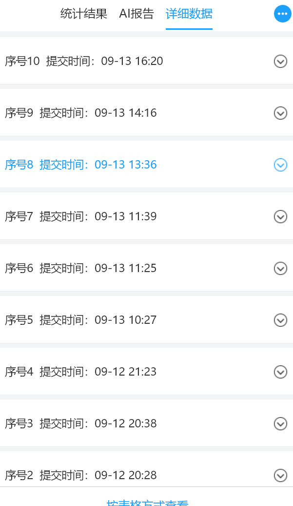
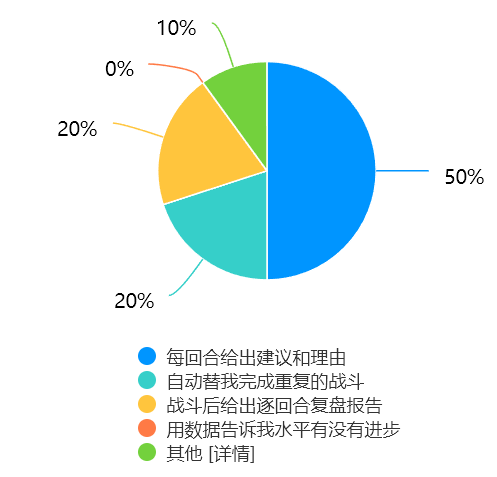
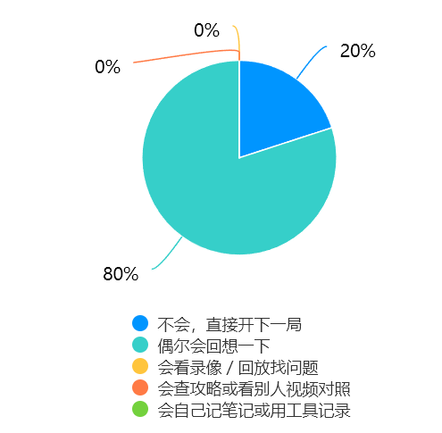
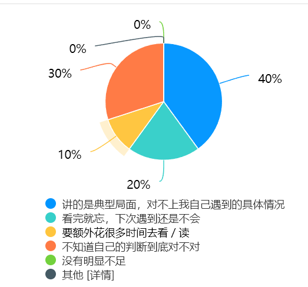
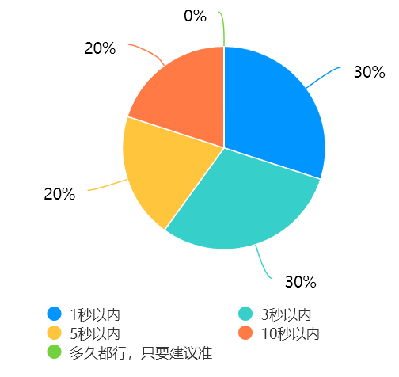
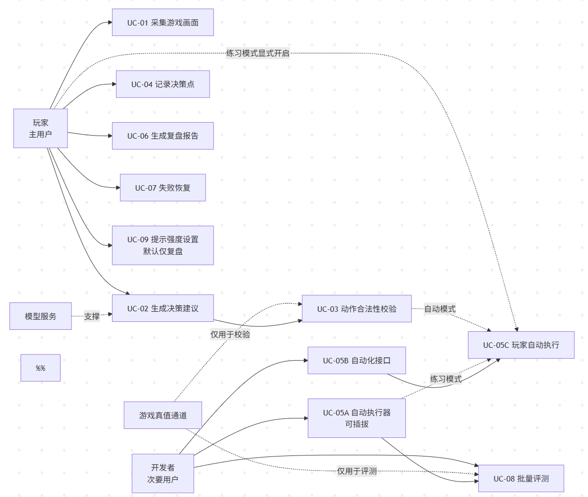

# 实验2：个人软件选题与需求分析

## 学习通提交说明

- **提交平台：** 只向学习通对应的"实验报告"作业上传一份PDF文件。
- **文件命名：** 班级-学号-姓名-实验2-个人软件选题与需求分析.pdf。
- **PDF内容：** 个人项目方案、需求说明V1、用户与场景证据、现有方案比较、用户故事与验收条件、AI能力分析及第2—17周个人计划。
- **截止时间：** 以学习通作业设置为准；报告中的仓库链接与Commit用于过程核验。

## 1. 实验目的

- 围绕真实或明确的用户问题完成个人软件选题，形成可在课程周期内独立完成的项目范围。
- 掌握用户、场景、功能需求、非功能需求、用户故事和验收条件的表达方法。
- 判断AI能力是否真正必要，并明确其输入、输出、价值、风险和非AI降级方案。

> **相关课程参考**
>
> - [Harvard CS85：Introduction to Generative AI via Building Software for the Study of Arts &amp; Sciences（2026课程目录）](https://seas.harvard.edu/computer-science/courses)：参考其从真实领域问题出发、再把问题转换为软件需求的组织方式。本实验要求先说明用户和实际困难，再决定使用什么AI技术。
> - [Harvard CS50：Final Project（2026）](https://cs50.harvard.edu/x/2026/project/)：参考其自主选题、解决真实问题和确定项目里程碑的做法。本课程将其调整为一人一款软件，并在需求阶段明确核心价值、范围和验收条件。

## 2. 实验内容

### 2.1 选题来源与问题陈述

- 用"目标用户—当前情境—主要困难—造成影响—拟解决方式"描述问题，避免使用空泛技术口号。
- 通过一次简短访谈、现场观察、个人真实经历或公开需求材料说明选题来源，并保留问题记录、观察摘要或资料链接等证据。
- 用一句话概括软件的核心价值，并说明用户在使用前后会发生什么可以观察到的变化。

### 2.2 用户画像与典型场景

- 至少定义1类主要用户，说明其目标、能力、使用环境、约束与痛点；项目存在管理者、内容提供者或其他使用者时，再补充相应的次要用户。
- 用具体场景描述用户如何进入软件、完成任务、获得结果，以及失败时如何处理。
- 为主要用户补充至少4个正常场景和2个异常场景，说明两种情况下软件分别应该如何响应。

### 2.3 现有方案与差异化

- 调研至少2个现有相似的产品、人工流程或开源方案，从功能、成本、隐私、易用性和AI能力等方面比较。
- 指出本项目不准备解决的问题，防止需求边界不断扩大。
- 总结现有方案中可以借鉴的设计和仍未解决的问题，明确本项目准备形成的差异。

### 2.4 用户故事、需求与验收条件

- 采用"作为……我希望……以便……"编写用户故事，并用"给定—当—那么"（Given/When/Then）写验收条件。
- 建立用例图、用例描述：编号、描述、优先级、来源、依赖、验收方法等；非功能需求至少覆盖性能、可靠性、安全或可用性中的两类。
- 围绕最核心的用户流程编写3—5个可直接用于后续实验的验收示例，至少包含正常情况、信息不足或失败情况以及需要人工确认的情况。

### 2.5 AI能力必要性与可行性

- 说明AI处理的任务为何难以完全用固定规则解决，明确模型输入、期望输出、允许错误和人工确认点。
- 分析数据来源、模型服务、费用、时延、隐私、幻觉和评测难点，给出非AI降级方案。
- 从2.4的验收示例中选择至少3组，补充输入、期望输出和判定方法，其中包含1组无法处理或需要人工确认的情况。

### 2.6 MVP(Minimum Viable Product)范围与第2—17周计划

- 形成一页个人项目方案，确定本学期只重点完成的一条核心用户流程，列出纳入MVP的功能和明确不在本学期实现的功能。
- 列出每一阶段的可运行成果、验收条件和风险，确保一人能够在课程周期内完成。
- 把计划落实到每周可检查的任务和阶段演示节点，并为可能延期的功能预留删减或替代方案。

## 3. 操作记录

> 本节按 2.1—2.6 记录调研、分析、方案取舍与需求变化，不只给出结论。文中"问题""取舍""需求变化"的编号在全文统一，便于对照。

**调研来源与证据汇总**

| 编号 | 来源                                                                              | 方式与时间                                              | 证据形式                                                                                       | 结论要点                                                                                                                                                             |
| ---- | --------------------------------------------------------------------------------- | ------------------------------------------------------- | ---------------------------------------------------------------------------------------------- | -------------------------------------------------------------------------------------------------------------------------------------------------------------------- |
| R1   | CommunicationMod（开源 Mod + 进程间协议）                                         | 阅读开源仓库说明，2026-09-11                            | 仓库链接、协议说明                                                                             | 外部进程控制该游戏技术上成立；可提供评测所需真值                                                                                                                     |
| R2   | spirecomm（开源 Python 库）                                                       | 阅读开源仓库说明，2026-09-11                            | 仓库链接                                                                                       | 存在成熟的 Python 接口与规则式 AI，可作为规则基线参考                                                                                                                |
| R3   | slay-the-spire-mcp（开源 MCP 服务器）                                             | 阅读开源仓库说明，2026-09-11                            | 仓库链接                                                                                       | 已有"大模型 + 该游戏"的方案，但其输入为游戏文本状态而非像素                                                                                                          |
| R4   | Cradle（开源研究框架）                                                            | 阅读框架说明，2026-09-11                                | 框架文档                                                                                       | "截图进、键鼠出"的接口设计可作为本项目决策层架构参考                                                                                                                 |
| R5   | 本人真实游玩经历                                                                  | 长期实际游玩，2026-09 前                                | 经历描述                                                                                       | "打错却不知错在哪"是反复出现的真实困境                                                                                                                               |
| R6   | 公开玩家讨论材料                                                                  | Steam 商店页与官方社区讨论区，2026-09-12                | 商店页与讨论区链接                                                                             | "如何提高胜率""复盘思路"是该类游戏的长期高频话题                                                                                                                     |
| R7   | **网络问卷（正式调研）**                                                    | 在线问卷，2026-09-12 至 2026-09-14 回收，有效样本 10 份 | 问卷题目全文、脱敏后的逐份作答与汇总统计（`docs/问卷结果.md`）、逐题统计截图（图 1—图 5）。 | 见 3.1、3.2 定量结论                                                                                                                                                 |
| R8   | 前期技术实测                                                                      | 2026-09-11（实验1 期间）                                | 运行记录 JSON 与终端输出                                                                       | 单次决策端到端时延 1942–8321 ms，为范围收敛提供直接依据                                                                                                             |
| R9   | **在线游戏自动化开源项目群**（ALAS／MAA／ok-ww／MaaEnd／ok-nte／ok-script） | 通过 GitHub API 获取仓库元数据，2026-09-13              | 仓库链接、星标数、开源许可与最近推送时间（见 3.3.1 表后说明，数据可复核）                      | 该方向成熟且活跃、需求真实；技术路线为计算机视觉 + 输入模拟；合规定位与范围取舍见 3.3.2                                                                              |
| R10  | **CombatSolver**（《杀戮尖塔 2》战斗路线求解器）                            | 阅读开源仓库 README，2026-09-13                         | 仓库链接与 README（主要功能、三种使用方式、开发者 API）                                        | **与本项目形态最相似的现有方案**：同为离散决策战斗，同样提供“仅查看／执行本回合／连续全自动”三档介入并公开开发者 API；但其实现依赖读取游戏内部状态做模拟搜索 |
| R11  | **MaaEnd**（《明日方舟：终末地》自动化）                                    | 阅读开源仓库 README，2026-09-13                         | 仓库链接与 README（功能列表）                                                                  | 修正先前判断：其“AI”仅用于**拼图解密**一个子功能，流程自动化由 MaaFramework 脚本完成                                                                         |

> **说明**：R1—R4、R6 为公开资料与开源方案调研，均给出可核验来源；R5 为本人真实经历；R7 为本次正式回收的问卷数据（有效样本 10 份）；R8 为在实验1 期间完成的实测；R9 为对同类开源项目群的元数据核验（2026-09-13，通过 GitHub API 获取）。

**仓库中的交付物**（讲义 §3 要求：在仓库中保存项目方案与需求说明 V1，并给出文件路径及对应 Commit）

| 文件路径                                | 说明                                                                               | 对应 Commit                 |
| --------------------------------------- | ---------------------------------------------------------------------------------- | --------------------------- |
| `docs/需求说明V1.md`                  | 本项目方案与需求说明 V1（含功能需求、非功能需求、验收条件、AI 边界与变更记录）     | 52dd46e                     |
| `docs/问卷结果.md`                    | 问卷题目全文、脱敏后的逐份作答（R1—R10）与汇总统计                                | 52dd46e                     |
| `docs/用例图.puml`                    | 用例图的等价源码（PlantUML 版，作为图 6 的备用绘制方案；正式图 6 由 StarUML 绘制） | 见本报告提交                |
| `docs/AI协作记录.md`                  | 前期调研与 AI 协作过程记录                                                         | 见实验1 报告                |
| `实验2-个人软件选题与需求分析.md`     | 本报告                                                                             | 见仓库`main` 分支最新提交 |
| `image/实验2-个人软件选题与需求分析/` | 报告图 1—图 6 的图片文件                                                          | 见仓库`main` 分支最新提交 |

> 说明：本项目的需求说明、调研证据与用例图源码均随本报告一并入库，可在仓库中按上表路径核验；`docs/需求说明V1.md` 内含版本变更记录（V1 → V1.1）。

---

### 3.1 选题来源与问题陈述（对应 2.1）

#### 3.1.1 问题陈述

| 要素                 | 内容                                                                                                                               |
| -------------------- | ---------------------------------------------------------------------------------------------------------------------------------- |
| **目标用户**   | 单机策略／卡牌类游戏的玩家（以本人及同学玩家为代表）                                                                               |
| **当前情境**   | 在一局 30–90 分钟的单机策略游戏（如《杀戮尖塔》）中，玩家需逐回合评估手牌、能量、敌人意图与自身状态，再决定行动顺序               |
| **主要困难**   | ① 决策依赖大量隐式经验，打错后难以定位错在哪一回合；② 缺少客观的复盘依据，只能靠印象；③ 重复对局耗时且枯燥，练习成本高          |
| **造成影响**   | 水平提升缓慢且不可量化；玩家无法判断"这一手是不是更好"，也无法确认自己的判断是否在改善                                             |
| **拟解决方式** | 构建一个以屏幕像素为唯一输入的视觉语言模型智能体：读取游戏画面 → 逐决策点给出建议动作与依据 → 记录 → 战斗结束输出逐回合复盘报告 |

#### 3.1.2 选题来源与证据

**来源一：本人真实经历（R5）**

本人为该类游戏的长期玩家。实际游玩中反复遇到同一困境：一局结束后只能凭印象回忆"哪一步打错了"，无法把"当时的局面—我做的选择—结果"对齐。尝试过的替代方式是看高手视频与查攻略，但这些材料针对的是**典型局面**，无法对应到自己遇到的**具体局面**，对复盘的帮助有限。

**来源二：网络问卷（R7，有效样本 10 份）**

考虑到现场访谈的覆盖面有限，本次采用**在线问卷**作为正式调研方式，题目以选择题为主以便回收。问卷共 13 题（12 道选择题 + 1 道选填开放题），题目全文与结果统计保存在仓库 `docs/问卷结果.md`。平台原始导出文件含填写者 IP 等个人信息，出于隐私考虑未入库。

**与选题相关的关键结果（N = 10）**

| 题号 | 题目要点                                     | 结果分布                                                                                                                                                                          | 对选题的意义                                                                                          |
| ---- | -------------------------------------------- | --------------------------------------------------------------------------------------------------------------------------------------------------------------------------------- | ----------------------------------------------------------------------------------------------------- |
| Q3   | 是否玩过单机策略／卡牌类游戏                 | 在玩且比较熟悉 5 人（50.0%）；玩过但不太熟 2 人（20.0%）；没玩过但听说过 2 人（20.0%）；完全不了解 1 人（10.0%）                                                                  | **70.0% 有相关游戏经历**，另有 20.0% 听说过但未玩过，目标用户定位成立                           |
| Q4   | 一局结束后是否复盘                           | **偶尔会回想一下 8 人（80.0%）**；完全不复盘 2 人（20.0%）；**看回放／查攻略对照／记笔记 均为 0 人**（0.0%）                                                          | **没有任何人采用系统化的复盘方式**——痛点存在且未被任何现有习惯解决                            |
| Q5   | "打完才发现某一手打错了、当时没意识到"的频率 | 经常（约一半的局）4 人（40.0%）；偶尔 2 人（20.0%）；很少 2 人（20.0%）；我很少打错／不玩这类游戏 2 人（20.0%）                                                                   | **60.0% 至少偶尔有此困扰**，其中 40.0% 达"约一半的局"                                           |
| Q7   | 现有提升方式最大的不足                       | **讲的典型局面、对不上具体情况 4 人（40.0%）**；不知道自己的判断到底对不对 3 人（30.0%）；看完就忘 2 人（20.0%）；要额外花时间 1 人（10.0%）；"没有明显不足" **0 人** | **70.0% 的不足都指向"缺少针对自己具体局面的客观依据"**（40.0% + 30.0%）；无人认为现有方式已足够 |

> **结论**：Q4、Q5、Q7 三题相互印证——用户**有复盘意愿但没有复盘手段**（Q4 中 80.0% 停留在“偶尔回想”、20.0% 干脆不复盘，且**无人采用看回放、对照攻略或记笔记等系统化方式**）；**能感受到决策失误但无法定位原因**（Q5 60.0% 有此困扰）；并且把现有方式的最大不足指向**“讲的是典型局面、对不上自己的具体情况”（40.0%）与“不知道自己的判断到底对不对”（30.0%）**——两项合计 70.0%，都指向同一个问题：**缺少针对自己具体局面的客观依据**。这构成选题的定量依据。

**调研证据图示**

图 1　问卷回收情况：显示问卷标题、题目数量与实际回收份数（N = 10），用于佐证调研确实执行。

图 2　Q9「如果这个工具只能做好一件事，你最希望是哪件」的统计结果：选择“每回合给出建议和理由”者最多（50.0%），“战斗后给出逐回合复盘报告”与“自动替我完成重复的战斗”各占 20.0%，另有 10.0% 选择“其他”并明确表示不需要此类工具。**该题是需求变化 C4、C5 的直接依据。**

图 3　Q4「一局游戏结束后，你通常会复盘吗」的统计结果：**80.0% 选择“偶尔会回想一下”**，20.0% 选择“不会，直接开下一局”，而**看回放、对照攻略或记笔记等系统化方式均为 0（0.0%）**。**该题是“缺少客观复盘依据”这一核心痛点的直接证据。**

图 4　Q7「你认为这些方式最大的不足是什么」的统计结果：40.0% 选择“讲的是典型局面、对不上我自己遇到的具体情况”，另有 30.0% 选择“不知道自己的判断到底对不对”、20.0% 选择“看完就忘”，无人选择“没有明显不足”。

图 5　Q11「每回合给建议时，你最多能接受等多久」的统计结果：80.0% 的容忍上限在 5 秒以内，其中 30.0% 为 1 秒以内，另有 20.0% 可接受 10 秒以内，无人选择“多久都行”。**该题是性能需求（P95 ≤ 5 s）与时延风险的依据。**

**来源三：公开材料（R6）**

《杀戮尖塔》在 Steam 商店页与官方社区讨论区中，"如何提高胜率""复盘思路"是长期存在的高频话题，说明"缺乏客观依据"是该类游戏的普遍需求。同时，社区已存在以外部程序控制该游戏的开源方案（R1），说明该需求已强到足以支撑第三方工具的长期维护。

#### 3.1.3 核心价值（一句话）

> **观弈让玩家在单机策略游戏中获得"看得见依据"的决策建议与逐回合复盘，把"凭手感打"变成"有依据地改进"。**

**定位说明（教练而非替身）**：策略类游戏的核心乐趣就是决策本身，因此**替玩家决策等于消灭游戏**。观弈把自己定位为**教练**——像棋手用 AI 复盘一样，帮助玩家理解“刚才那一手为什么不好”，**决策权始终在玩家手上**。围棋界的实践已经给出了这一区分的答案：**“AI 代打（遛狗）”被明令禁止且为圈内所鄙视，而“AI 复盘”是公认的正当训练方法**，并让整个围棋界的水平上了一个台阶。因此本项目**不做代打**，而做“**辅助理解、不替代决策**”。（该定位的由来见需求变化 C5，其触发点是同学的一句质疑：“策略类游戏自动化？那人还玩啥”。）

#### 3.1.4 用户使用前后的可观察变化

|              | 使用前（有问卷依据）                                                                           | 使用后（可观察）                                     |
| ------------ | ---------------------------------------------------------------------------------------------- | ---------------------------------------------------- |
| 决策过程     | 凭手感出牌，说不清为什么这样打（Q4：80.0% 仅靠"偶尔回想"，20.0% 不复盘）                       | 每个决策点在屏幕上给出建议动作与一句依据             |
| 复盘方式     | 靠印象回忆，无法对齐具体局面（Q7：40.0% 认为"对不上自己的具体情况"、30.0% "不知道判断对不对"） | 战斗结束后得到逐回合复盘表（局面—选择—依据—结果） |
| 决策失误定位 | 事后才发现、不知错在哪（Q5：60.0% 有此困扰）                                                   | 复盘报告标出损失最大的若干决策点，可直接对照         |
| 水平判断     | 只能凭胜负感觉                                                                                 | 可在固定局面集上对比不同版本的表现（量化）           |

#### 3.1.5 调研的局限（如实记录）

本次问卷有效样本 **10 份**，样本量仍偏小，百分比仅具**指示性**，不足以支撑统计推断；样本以重度玩家为主（Q1：每周游戏 14 小时以上者占 90.0%），轻度玩家仅 1 人；渠道全部来自微信同学圈，存在同质化偏差；其中 **3 份为非目标用户样本**（Q3 选择“完全不了解”或“没玩过，但听说过”），故关键结论同时给出**全样本（N=10）与目标用户子集（n=7）两种口径**；选填开放题中给出具体游戏情境的仅 2 条（2/10），说明开放题在该群体中回收质量有限。因此本报告的定量结论应视为**方向性证据**，而非普适结论。为降低该局限的影响，本报告在 3.5 节对关键设计决策（如时延要求、截图范围）均采用了**偏保守**的取值。

**调研过程的另一点记录**：本次问卷未设置任何激励，发放渠道也局限于同学圈，实际回收 10 份，低于预期。这提示一个现实约束——**面向小众玩家群体的问卷调研，若无激励或垂直社区渠道，回收量会显著受限**；后续如需扩大样本，应改为在游戏垂直社区发布，或提供小额激励。此外，选填开放题中给出具体游戏情境的仅 2/10，也从侧面印证了填答意愿偏低，这与问卷设计时"以选择题为主以降低填写负担"的取舍相互印证，说明**在低意愿场景下，继续增加题目数量或开放题比例，只会降低回收质量而不会提高信息量**。

---

### 3.2 用户画像与典型场景（对应 2.2）

#### 3.2.1 主要用户画像

| 维度     | 内容                                                                                                                                                                                      | 依据                                                                                     |
| -------- | ----------------------------------------------------------------------------------------------------------------------------------------------------------------------------------------- | ---------------------------------------------------------------------------------------- |
| 身份     | 单机策略／卡牌类游戏玩家，本科在读                                                                                                                                                        | Q3：70.0% 有该类游戏经历                                                                 |
| 游戏强度 | 每周游戏 14 小时以上（重度玩家）                                                                                                                                                          | Q1：14–28 小时 40.0%、28 小时以上 50.0%（另有 10.0% 少于 3 小时）                       |
| 目标     | 提升单机策略游戏的水平；理解"为什么这样打更好"                                                                                                                                            | Q7：40.0% 选择“对不上自己的具体情况”、30.0% 选择“不知道判断对不对”"不知道判断对不对" |
| 能力     | 熟悉游戏机制；能完成软件安装与基本配置；不具备编程能力                                                                                                                                    | 问卷未直接测量，依据本人在同学群体中的观察                                               |
| 使用环境 | Windows 笔记本电脑，游戏窗口化运行，单人使用                                                                                                                                              | 依据本人与同学的共同环境                                                                 |
| 约束     | ① 不愿为辅助工具修改游戏本体或使用外挂；② 不希望整屏被截取（Q12：50.0% 要求只截游戏窗口，另有 20.0% 希望完全本地处理、10.0% 很介意）；③ 对等待敏感（Q11：80.0% 的容忍上限在 5 秒以内） | Q11、Q12                                                                                 |
| 痛点     | 缺少客观复盘依据；能感到失误却无法定位；重复对局耗时                                                                                                                                      | Q4、Q5、Q7                                                                               |
| 现有行为 | 90.0% 使用攻略／Wiki、70.0% 看高手视频，**0% 使用过工具或插件**                                                                                                                     | Q6                                                                                       |
| 成功体验 | 打完一场后能指出"第 3 回合那张牌不该打"，并能说明依据                                                                                                                                     | 由核心价值推导                                                                           |

**现有替代行为的分布（Q6，多选）**

| 方式                                 | 人数        | 比例                                  |
| ------------------------------------ | ----------- | ------------------------------------- |
| 查攻略、Wiki、论坛帖                 | 9           | 90.0%                                 |
| 看高手视频／直播                     | 7           | 70.0%                                 |
| 和朋友讨论                           | 5           | 50.0%                                 |
| 自己反复重打同一关／同一局           | 2           | 20.0%                                 |
| 用工具或插件（伤害计算器、模拟器等） | **0** | **0%**                          |
| 都没用过                             | 1           | 10.0%（该样本自述完全不了解该类游戏） |

> 该分布说明两点：① 用户的提升行为高度集中在**人工查阅为主的被动方式**；② **工具类方案在该群体中的渗透率为 0**，既说明存在空白，也说明本项目需要面对"用户没有使用工具的习惯"这一现实。

#### 3.2.2 次要用户画像

| 维度           | 内容                                                                                       |
| -------------- | ------------------------------------------------------------------------------------------ |
| 身份           | 学习或开发视觉语言模型（VLM）智能体的学生与开发者                                          |
| 目标           | 获得一套可复现的"读屏—决策—记录—评测"参考实现与评测基线，用于对比不同模型或提示策略     |
| 能力           | 具备编程能力，可阅读并修改 Python 代码                                                     |
| 痛点           | 从零搭建感知、记忆与评测体系成本高；现有方案多直接读取游戏内部数据，缺少"纯视觉"的对照实现 |
| 与本项目的关系 | 本项目的差异点（像素优先、真值隔离、可复现评测）正是为该类用户设计                         |

#### 3.2.3 典型场景

**正常场景**

| 编号 | 场景                                       | 系统应如何响应                                                                                   |
| ---- | ------------------------------------------ | ------------------------------------------------------------------------------------------------ |
| N1   | 玩家进入一场战斗，希望逐回合获得建议       | 自动截取**游戏窗口区域**画面，识别当前局面，在界面上给出建议动作与一句依据，并等待玩家操作 |
| N2   | 玩家认可建议并按建议出牌                   | 系统检测到画面变化，判定该回合已结算，记录"局面—建议—玩家实际操作—结果"，进入下一回合         |
| N3   | 玩家在练习／重复场景下选择"自动执行"       | 系统按建议自动执行动作并逐回合记录，每次执行前做一次合法性校验                                   |
| N4   | 战斗结束，玩家想知道哪里打得好、哪里打得差 | 输出复盘报告：逐回合列出局面、选择、依据与结果，标出损失血量最高的 3 个决策点                    |

> 说明：依据问卷 Q9（"自动替我完成重复的战斗"得票 2/10，即 20.0%，远低于“建议+理由”的 50.0%）与 Q10（50.0% 仅在“重复刷／练习”场景接受自动，另有 30.0% 完全不接受自动），**自动执行被定位为可选能力而非核心能力**，故置于 N3 而非首要场景。

**异常场景**

| 编号 | 场景                                                 | 系统应如何响应                                                                                             |
| ---- | ---------------------------------------------------- | ---------------------------------------------------------------------------------------------------------- |
| E1   | 画面被弹窗遮挡，或手牌区域不可辨认                   | **不得猜测**。输出"本回合无法识别，请确认画面"，暂停并等待人工处理，记录一次 `low_confidence` 事件 |
| E2   | 系统执行了动作但画面无变化                           | 重试 2 次；仍无效则停止自动执行、提示玩家并记录`injection_failure`，**不得无限重试**               |
| E3   | 模型给出的建议不合法（如能量不足时出牌）或与规则冲突 | 以规则校验结果为准，拦截该动作、记录`guardrail_trigger` 并提示玩家，不得直接执行                         |
| E4   | 模型服务不可用或返回内容为空                         | 提示服务异常，保留已记录的回合数据；允许玩家手工操作继续，恢复后自动继续记录                               |
| E5   | 单次决策耗时明显超出预期（如超过 5 秒）              | 界面显示"正在识别"的进度反馈；若持续超过阈值，提示用户可切换到批量／自动模式（该模式对等待不敏感）         |

> E1、E3 对应讲义要求的"信息不足或失败情况"与"需要人工确认的情况"；E5 由 Q11 的时延容忍度结论导出。

---

### 3.3 现有方案与差异化（对应 2.3）

#### 3.3.1 现有方案调研

| #  | 方案                                                               | 类型与功能                                                                        | 成本 / 隐私 / 易用性                                          | AI 能力                                                                                        |
| -- | ------------------------------------------------------------------ | --------------------------------------------------------------------------------- | ------------------------------------------------------------- | ---------------------------------------------------------------------------------------------- |
| 1  | **CommunicationMod**（含社区分支）                           | 开源 Mod + 进程间协议；通过进程间通信让外部程序完全控制游戏，可读取完整游戏状态   | 免费；数据不出本机；需安装 Mod，有配置门槛                    | 本身不含模型，需自行接入                                                                       |
| 2  | **spirecomm**                                                | 开源 Python 库；在 CommunicationMod 之上提供 Python 接口，并附带一个简单 AI       | 免费；数据不出本机；需 Python 环境                            | 内置 AI 为规则式                                                                               |
| 3  | **slay-the-spire-mcp**                                       | 开源 MCP 服务器；把游戏状态接入大模型，作为“战略副驾”提供建议                   | 免费（模型费另计）；状态数据发送至模型服务；需配置 MCP 与模型 | 依赖文本状态，非像素输入                                                                       |
| 4  | **Cradle**                                                   | 开源研究框架；以截图作为输入、键鼠作为输出的通用计算机控制                        | 免费（模型费另计）；截图发送至模型服务；依赖较重，配置复杂    | 通用 VLM 智能体，含记忆模块                                                                    |
| 5  | **UI-TARS 等端到端 GUI 智能体**                              | 开源模型 + 框架；端到端 GUI 操作，具备通用界面理解能力                            | 需较强算力或云服务；截图发送至服务；部署门槛高                | 通用性强，但非针对特定游戏                                                                     |
| 6  | **宏脚本／固定规则脚本**                                     | 人工流程；录制固定操作序列并重放                                                  | 免费；完全本地；简单                                          | **无 AI**，只能处理完全固定的局面                                                        |
| 7  | **攻略／Wiki／高手视频**（用户实际主要使用的方式）           | 人工流程；提供典型局面的参考解法                                                  | 免费；无隐私顾虑；无门槛                                      | 无 AI，**无法对应到玩家的具体局面**                                                      |
| 8  | **在线游戏自动化工具群**（ALAS／MAA／ok-ww／MaaEnd／ok-nte） | 开源自动化工具（Python／C++）；全自动完成在线游戏的日常任务、刷素材与自动战斗     | 免费；多在本机处理；需配置游戏与运行环境，有使用门槛          | 以**计算机视觉（模板匹配／OCR）+ 输入模拟**为主；MaaEnd 的 AI 仅用于拼图（详见下方说明） |
| 9  | **ok-script**                                                | 开源视觉自动化框架；方案 8 中多个项目基于它构建                                   | 免费；本机处理；面向开发者                                    | 计算机视觉框架，本身不含决策模型                                                               |
| 10 | **CombatSolver**（《杀戮尖塔 2》战斗路线求解器）             | 游戏 Mod + 外部求解进程；后台模拟当前局面并搜索，给出推荐路线、预计战损与关键行动 | 免费；需读取游戏内部状态；以 Mod 形式集成，配置简单           | **基于模拟搜索**（非大模型），可给出精确最优路线                                         |

> 方案 7 由问卷 Q6 证实为用户实际主要使用的方式（攻略／Wiki 90.0%、高手视频 70.0%），其不足由 Q7 量化（40.0% 认为“讲的是典型局面、对不上自己的具体情况”，另有 30.0% 选择“不知道自己的判断到底对不对”）。
>
> **方案 8、9 的实测数据**（2026-09-13 通过 GitHub API 获取仓库元数据，可核验）：[AzurLaneAutoScript](https://github.com/LmeSzinc/AzurLaneAutoScript) **9,616★**／GPL-3.0；[MaaAssistantArknights](https://github.com/MaaAssistantArknights/MaaAssistantArknights) **23,228★**／AGPL-3.0；[ok-wuthering-waves](https://github.com/ok-oldking/ok-wuthering-waves) **7,304★**／AGPL-3.0；[MaaEnd](https://github.com/MaaEnd/MaaEnd) **3,841★**／AGPL-3.0；[ok-nte](https://github.com/BnanZ0/ok-nte) **1,205★**／GPL-3.0；[ok-script](https://github.com/ok-oldking/ok-script) **732★**。**合计约 4.5 万星标，且全部在 2026-09-11 至 09-13 之间仍有提交**——说明该方向成熟、活跃、真实需求巨大。
>
> **对本项目的意义**：方案 8 证明"**读屏 → 识别 → 模拟输入**"这条技术路线在真实产品中是**可行的、有市场的**，这是对本项目可行性判断的**正面证据**；但它们的游戏类型与合规定位与本项目不同，故不纳入本项目范围（理由见 3.3.2）。
>
> **方案 10（CombatSolver）是本项目最重要的对照对象**：它与本项目面向同一类游戏（《杀戮尖塔》系列）、同一类问题（战斗中的行动顺序决策），并已提供与本项目设计一致的**三档介入方式**（仅查看／执行本回合／连续全自动）与**面向开发者的公开 API**——说明这些设计选择在真实产品中已被验证成立。
>
> 但它与本项目存在一个**架构层面的根本差异**：CombatSolver 作为游戏 Mod，可以**读取游戏内部状态并在后台做完全模拟搜索**，因此能给出精确最优路线；而本项目的命题恰恰是**在不读取任何游戏内部数据、只看到屏幕像素的条件下，决策能做到什么程度**。这是它在架构上**无法回答**的问题（见 3.3.4）。

#### 3.3.2 本项目明确不解决的问题

- **不做在线游戏的日常任务／刷素材自动化**（即选题之初设想的方向：MMORPG 刷素材、开放世界二次元游戏的日常任务）。**需要说明的是：该方向并非不可为，而是不适合本项目。** 该领域存在大量成熟的开源实现（见 3.3.1 方案 8、9，合计约 4.5 万星标且持续活跃），因此这是一项**基于具体理由的范围决策**，而不是"该领域不可做"的判断。不做的理由如下：
  1. **合规与账号风险真实存在，且由使用者承担。** 这类工具均违反目标游戏的用户协议——部分游戏的终端用户许可协议明确将"自动升级、自动练级、自动拾取、**自动完成任务**"等列为未经许可的第三方软件（其中竞技对抗类游戏还会直接损害同局其他玩家的体验，问题更为严重）。同类项目也会在仓库中保留用户协议文件以提示该风险。本项目的目标用户是同学与玩家，**不应要求他们为使用一个课程项目而承担账号被封的代价**。
  2. **反作弊与版本对抗是持续成本，非一人一学期可承担。** 该领域的成熟项目均为多年持续迭代：AzurLaneAutoScript 自 2020 年、MaaAssistantArknights 自 2021 年起维护至今，且全部在最近一周内仍有提交。这类工具必须跟随游戏版本更新与反作弊策略持续适配。
  3. **技术路线与本项目命题不匹配。** 该领域以**针对特定游戏的计算机视觉工程**（模板匹配／OCR + 输入模拟）为主，属于"为单个游戏做精确适配"；而本项目的命题是**通用视觉语言模型的决策能力**与**可复现评测**。走专属 CV 路线等于放弃本项目的核心差异化。
  4. **与本项目已定型的用户价值不一致。** 问卷显示目标用户要的是"建议 + 理由"而非"代打"（Q9：“自动替我完成重复的战斗”得票 2/10 即 20.0%，远低于“建议+理由”的 50.0%，见需求变化 C4）；而在线游戏的"日常任务自动化"本质就是代打。
  5. **许可约束。** 该领域项目多采用 AGPL-3.0／GPL-3.0 等强传染性许可，参考其代码会约束本项目的开源许可选择（本项目采用 MIT）。
- **同时应承认**：该方向的繁荣恰恰说明"读屏 → 识别 → 模拟输入"这条路线在真实产品中可行且有巨大需求，这一认识已作为**正面证据**记入 3.3.1，而非相反。
- 不做完整一局的对局策略优化（地图选路、商店、事件、遗物取舍等）。
- 不做多角色与高难度（Ascension）覆盖。
- 不做实时动作类游戏（需毫秒级反应）。
- 不做模型的自训练与权重级微调。
- 不做跨游戏泛化能力的验证（仅保留架构上的通用性设计）。
- **不把"自动代打"作为产品核心卖点**（依据问卷 Q9：该项得票 2/10 即 20.0%，远低于“建议+理由”的 50.0%，见需求变化 C4）。

#### 3.3.3 可借鉴的设计与仍未解决的问题

**可借鉴**

- 现有方案普遍采用"外部进程控制 + 结构化日志"的思路，说明该架构可行，且**逐回合记录**是这类工具的必备能力。
- slay-the-spire-mcp 验证了"大模型 + 游戏"的可行性，但其输入端依赖文本状态——这恰好暴露了本项目的机会点。
- Cradle 的"以截图作为输入、键鼠作为输出"接口设计，与本项目的决策层设计目标一致，可作为架构参考。
- 现有方案普遍提供"真值通道"（如 CommunicationMod），说明**用真值做评测**是社区共识。

**仍未解决的问题**

- 现有方案大多**绕过视觉**：直接读取游戏内部状态。这使其无法迁移到没有开放接口的游戏，也无法验证模型对画面的真实理解能力。
- 现有方案普遍**缺少可复现的评测体系**：多为演示性质，缺少固定局面集、基线与指标。
- 现有方案**几乎没有对记忆机制做实验性验证**（是否真的带来提升）。
- 面向用户的辅助方案（方案 7）**无法把建议对应到玩家的具体局面**，这是问卷 Q7 中最主要的不足（40.0% 选择“讲的是典型局面、对不上自己的具体情况”，另有 30.0% 选择“不知道自己的判断到底对不对”）。

#### 3.3.4 本项目的差异化

> **在只允许模型看到屏幕像素的前提下，构建一套"感知—决策—记录—复盘"的闭环，并提供固定局面集与基线的可复现评测。**

三点具体差异：

1. **像素优先**：决策层输入只有屏幕截图，不读取任何游戏内部数据；真值通道仅用于**离线评测与合法性校验**，不进入模型上下文。这保证方案不被单一游戏绑死。
2. **可复现评测**：固定种子局面集 + 三类基线（随机／规则脚本／人类），使"是否变好"可被量化。
3. **记忆机制可验证**：把"学习"实现为可检查的记忆级机制（结构化笔记），并做有无对比的消融实验。

**用现有最优方案反向论证差异化**：CombatSolver（方案 10）之所以能给出精确的推荐路线与预计战损，前提是它作为 Mod **读取了游戏内部状态**并做完全模拟搜索——走的正是“**绕过视觉**”这条捷径。这意味着“缺少客观决策依据”这一问题，在目前最优秀的现有方案上**同样存在**：一旦把“读取游戏内部状态”这条路径堵死（例如游戏没有开放接口、或需要跨游戏迁移），现有方案即失效。本项目要回答的正是这个问题：**只允许看像素时，决策能做到什么程度、以及如何被测量。**

---

### 3.4 用户故事、需求与验收条件（对应 2.4）

#### 3.4.1 用户故事

| 编号  | 用户故事                                                                                                                                                 | 优先级                     | 依据                                                                                                                                                    |
| ----- | -------------------------------------------------------------------------------------------------------------------------------------------------------- | -------------------------- | ------------------------------------------------------------------------------------------------------------------------------------------------------- |
| US-01 | **作为**想提升水平的单机策略游戏玩家，**我希望**在每个决策点看到建议动作和一句理由，**以便**理解"为什么这样打更好"而不只是照做         | **高**               | Q9：50.0% 首选"每回合给出建议和理由"；Q8：80.0% 持正面态度（"一定会用"10.0% + "可能会用"50.0% + "看情况"20.0%）                                         |
| US-02 | **作为**一名玩家，**我希望**战斗结束后拿到逐回合复盘表，**以便**定位自己真正打错的那一回合                                             | **高**               | Q4：80.0% 仅"偶尔回想"且无人系统化复盘；Q7：40.0% "对不上自己的具体情况"；Q9：20.0% 首选复盘报告                                                        |
| US-03 | **作为**一名玩家，**我希望**在练习或重复场景下可以自动完成战斗，**以便**把时间花在复盘而不是重复操作上                                 | **低**（由"中"下调） | Q9：**"自动替我完成重复的战斗"得票 2/10（20.0%），远低于"建议+理由"的 50.0%**；Q10：30.0% 完全不接受自动操作，50.0% 仅接受"重复刷／练习时自动"    |
| US-04 | **作为**一名玩家，**我希望**系统在画面看不清时明确说"看不清"而不是猜，**以便**我不会被错误的建议误导                                   | **高**               | 实测：密集小字界面出现误读（见 3.5.3）；属可靠性底线                                                                                                    |
| US-05 | **作为**一名玩家，**我希望**不合法或与规则冲突的建议能被拦下来，**以便**它不会把对局搞坏                                               | **高**               | Q10：80.0% 对自动操作设有前提条件（完全不接受 30.0% + 仅限重复场景 50.0%），说明用户对"失控"有顾虑                                                      |
| US-06 | **作为**一名学习 VLM 智能体的开发者，**我希望**能在固定局面集上对比不同模型／提示策略并得到量化结果，**以便**判断改动是否真的有效      | 中                         | 次要用户画像；对应差异化第 2 点                                                                                                                         |
| US-07 | **作为**一名玩家，**我希望**能自己选择工具介入的程度（仅复盘／卡关时建议／逐决策点建议），**以便**在“自己玩”与“被帮助”之间取得平衡 | **高**               | Q8 答案分散（“一定会用”1 人、“可能会用”5 人、“看情况”2 人）；Q9 中“建议”50.0% 与“复盘”20.0% 并存；以及“替玩家决策会破坏乐趣”的质疑（见 C5） |

#### 3.4.2 用例描述

| 编号   | 用例（描述）                                                                         | 优先级 · 来源 · 依赖              | 验收方法                                             |
| ------ | ------------------------------------------------------------------------------------ | ----------------------------------- | ---------------------------------------------------- |
| UC-01  | 采集游戏画面：截取**游戏窗口区域**画面并确认有效性                             | 高 · US-01、Q12 · 无              | 截图非黑屏、非空；尺寸符合预期                       |
| UC-02  | 生成决策建议：由截图生成结构化动作建议与一句依据                                     | 高 · US-01 · UC-01                | 输出可解析为合法动作 JSON                            |
| UC-03  | 动作合法性校验：用规则护栏校验建议是否合法                                           | 高 · US-05 · UC-02                | 非法建议被拦截并记录                                 |
| UC-04  | 记录决策点：记录局面、建议、玩家实际操作与结果                                       | 高 · US-02 · UC-02                | 日志完整、可回放                                     |
| UC-05A | 自动执行器（可插拔）：提供可互换的动作执行实现（DryRun／键鼠注入／预留游戏专用通道） | **高** · US-06 · UC-03      | 三种执行器可互换；决策层不依赖具体实现               |
| UC-05B | 自动化接口：将“给定局面 → 动作序列”与“执行本回合”暴露为可编程契约               | 中 · US-06、US-03 · UC-02、UC-05A | 接口可被独立脚本调用并产出结构化结果                 |
| UC-05C | 玩家练习模式自动执行：玩家显式开启后代为完成对局（**默认关闭**）               | 低 · US-03 · UC-05A               | 画面发生预期变化；玩家可随时中断                     |
| UC-06  | 生成复盘报告：输出逐回合复盘表与关键决策点                                           | 高 · US-02 · UC-04                | 报告含每回合四项信息                                 |
| UC-07  | 失败恢复：动作无效或服务异常时停止并提示                                             | 高 · US-04 · UC-05C               | 不出现无限重试；有明确提示                           |
| UC-08  | 批量评测：在固定局面集上批量运行并输出指标                                           | 中 · US-06 · UC-04、UC-05A        | 输出胜率／平均损耗与方差                             |
| UC-09  | 提示强度设置：玩家在“仅复盘／卡关时建议／逐决策点建议”三档间切换                   | **高** · US-07 · 无         | 切换后行为符合所选档位；**默认档为“仅复盘”** |

#### 3.4.3 用例图

图 6　观弈用例图（用 **StarUML** 手动绘制）：

#### 3.4.4 非功能需求（覆盖性能、可靠性、安全、可用性四类）

| 类别               | 需求                                                                                                                                                         | 依据                                                                       | 判定方式                                                                     |
| ------------------ | ------------------------------------------------------------------------------------------------------------------------------------------------------------ | -------------------------------------------------------------------------- | ---------------------------------------------------------------------------- |
| **性能**     | 单次决策端到端时延目标：P50 ≤ 3 s、**P95 ≤ 5 s**                                                                                                     | Q11：80.0% 受访者的容忍上限在 5 秒以内；其中 30.0% 为"1 秒以内"            | 记录时延分布并出图；若未达标须在报告中说明差距与缓解措施                     |
| **性能**     | 支持无人值守批量运行；单局成本可核算并受上限约束                                                                                                             | 评测需要                                                                   | 连续运行 20 局无中断；每局 token 用量与折算费用入日志                        |
| **可靠性**   | 动作注入失败必须被检出并停止重试（上限 2 次）；模型返回为空或非法时必须拦截                                                                                  | US-04、US-05                                                               | 构造失败用例验证；日志中出现对应事件码                                       |
| **可靠性**   | 固定种子与固定模型版本下，同一局面的决策序列应可复现                                                                                                         | 评测可信性                                                                 | 重跑同一局面集并报告方差                                                     |
| **安全**     | **仅截取游戏窗口区域，不采集整屏**                                                                                                                     | Q12：50.0% 明确要求只截游戏窗口，另有 20.0% 要求完全本地处理、10.0% 很介意 | 代码中限定截图区域；人工验证截图内容                                         |
| **安全**     | API 密钥仅通过环境变量读取；截图、日志与运行记录不入版本库                                                                                                   | 讲义与合规要求                                                             | `git check-ignore -v .env` 命中忽略规则；`git status` 中不出现截图与日志 |
| **可用性**   | 启动后无需命令行操作；失败信息必须以人类可读的中文给出，并说明可采取的动作                                                                                   | 主要用户不具备编程能力                                                     | 人工验证；失败提示含原因与建议动作                                           |
| **可扩展性** | 动作执行器必须**可插拔**（DryRun／键鼠注入／游戏专用通道三种实现），决策层不得依赖任何具体执行实现；“仅复盘”模式由 DryRun 执行器提供，不单独实现分支 | 支撑“可迁移”主张，并为后续接入其他游戏保留接口（见 C5）                  | 替换执行器后决策层代码无需修改；DryRun 模式下无任何真实输入注入              |

#### 3.4.5 核心流程验收示例（Given / When / Then）

| #  | 类型         | Given（给定）                              | When（当）        | Then（那么）                                                                                    |
| -- | ------------ | ------------------------------------------ | ----------------- | ----------------------------------------------------------------------------------------------- |
| A1 | 正常         | 游戏处于战斗画面且手牌清晰可辨             | 系统完成一次决策  | 输出一个可解析的合法动作、画面正确响应，日志记录`局面→建议→（实际操作）→结果` 四项         |
| A2 | 正常         | 固定种子局面集中的某一局面                 | 批量运行 20 局    | 全部完成、无崩溃，产出胜率与平均损耗，并报告方差                                                |
| A3 | 信息不足     | 画面被弹窗遮挡或手牌不可辨认               | 模型无法确定局面  | 输出"无法识别"并**暂停等待人工处理**，记录 `low_confidence`，**不得输出猜测动作** |
| A4 | 失败         | 已执行动作但画面无变化                     | 重试 2 次仍无变化 | 记录`injection_failure` 并停止自动执行、提示玩家，**不得继续重试**                      |
| A5 | 需要人工确认 | 模型输出与规则校验冲突（如能量不足时出牌） | 冲突发生          | 拦截该动作、以规则为准、记录`guardrail_trigger`，并提示玩家确认                               |

---

### 3.5 AI能力必要性与可行性（对应 2.5）

#### 3.5.1 AI 为何难以用固定规则替代

固定规则脚本要正确处理局面，必须穷举"手牌组合 × 能量 × 敌人意图 × 遗物状态 × 血量与护甲"的组合。该类游戏的局面空间随卡牌与遗物数量呈组合爆炸，**固定规则无法穷举**；一旦换成另一款游戏，规则需全部重写。

本项目的核心诉求是**通用性**：同一套决策层要能迁移到其他离散决策游戏。这要求决策层面对的是**未经结构化处理的像素**，而把像素映射为语义化局面判断正是视觉语言模型的适用场景——**这是固定规则在原理上无法覆盖的部分**。

但需明确：**AI 的适用范围有边界**。动作合法性校验、失败重试、日志与评测统计等环节**应当使用规则实现**，不应交给模型。规则护栏是 AI 的必要配套，而非替代。

**跨领域的同构证据**：MaaEnd（3,841★ 的《明日方舟：终末地》自动化工具）把“AI”**仅用于拼图解密**这一个子功能，而其日常流程自动化全部由 MaaFramework 的脚本完成。拼图恰是“规则无法穷举、需要模型推理”的组合问题。这说明**“AI 只用在规则覆盖不到的地方、其余交给规则”已经是同类工具在实践中的共识分工**，与本项目“AI 负责决策、规则负责护栏与统计”的边界划分一致。

#### 3.5.2 模型输入、期望输出、允许错误与人工确认点

| 项                   | 内容                                                                                                                                                                                        |
| -------------------- | ------------------------------------------------------------------------------------------------------------------------------------------------------------------------------------------- |
| **输入**       | 一张游戏窗口区域的屏幕截图（不含任何游戏内部数据）；一份与游戏无关的通用动作 schema 说明                                                                                                    |
| **期望输出**   | 结构化结果（JSON）：动作类型 + 目标 + 一句依据；无法确定时输出"无法识别"                                                                                                                    |
| **允许错误**   | 可接受：单决策点的次优建议、依据表述不精确。**不可接受**：非法动作、空返回、崩溃、无限重试、把不确定的局面当成确定的                                                                  |
| **人工确认点** | ① 首次使用或更换游戏时，确认截图区域与画面比例；② 动作连续 2 次未生效时；③ 模型输出与规则校验冲突时；④ 用户由"建议模式"切换到"自动模式"时（依据 Q10：80.0% 用户对自动操作设有前提条件） |

#### 3.5.3 可行性分析

| 维度                          | 分析与结论                                                                                                                                                                                                                                                           |
| ----------------------------- | -------------------------------------------------------------------------------------------------------------------------------------------------------------------------------------------------------------------------------------------------------------------- |
| **数据来源**            | 截图由本机实时采集；游戏内部真值仅用于评测标注与合法性校验，**不进入模型上下文**。无需自建训练集                                                                                                                                                               |
| **模型服务**            | 使用具备图像模态的云端模型（DeepSeek Flash 系列）。已实测可正常读取截图中文字与界面元素                                                                                                                                                                              |
| **费用**                | 已实测单次决策折算费用**0.0014–0.0067 元**（随截图内容与回答长度变化；空闲时段单价为高峰时段的一半）。按每局 50 次决策推算，1000 局成本约 **37–219 元**。**输出 token 占总费用的 84%**，是成本主因                                               |
| **时延（🔴 主要风险）** | 已实测单次决策端到端时延**1942–8321 ms**（含模型内部推理）。而问卷 Q11 显示：**80.0% 受访者的容忍上限在 5 秒以内，其中 30.0% 为 1 秒以内**，且无人接受"10 秒以上"。**即实测时延已超出多数用户的容忍范围**。结论与缓解措施见下方"风险与缓解"       |
| **隐私**                | 截图不可避免地包含屏幕内容。由 Q12 提供依据：50.0% 用户明确要求**只截游戏窗口区域**，另有 20.0% 要求完全本地处理、10.0% 很介意。缓解措施：① 仅截取游戏窗口区域而非整屏；② 截图与运行日志不入版本库；③ 密钥仅由环境变量提供                                  |
| **幻觉与读数风险**      | 实测：在清晰、大字号图像上读数 100% 正确；在信息密集的小字界面出现误读（如将文件名读作近似的其他名称）。因此**不能假设"模型读屏必然正确"**，必须设计读数校验与"看不清就明说"的约束。实测同时显示该约束有效：模型在无法辨认时会主动列出"看不清或无法确认的部分" |
| **评测难点**            | ① 游戏含随机性 → 用固定种子局面集；② 模型版本可能变化 → 记录调用名与日期、报告方差；③ "打得好"难定义 → 用胜率、平均损耗等可计算指标，并与随机／规则基线对比                                                                                                    |

**风险与缓解：时延与用户容忍度的差距**

| 项                        | 数值                                                                         |
| ------------------------- | ---------------------------------------------------------------------------- |
| 实测单次决策时延          | 1942 – 8321 ms                                                              |
| 用户容忍上限（Q11，N=10） | 1 秒以内 30.0%；3 秒以内 30.0%；5 秒以内 20.0%；10 秒以内 20.0%；多久都行 0% |

缓解措施（按优先级）：

1. **利用"决策点采样"天然掩盖等待**：等待发生在两次决策之间，而非玩家操作过程中，对连续操作的打断较小。
2. **压缩输出长度**：实测输出 token 占总费用 84%，同时也是时延的主要来源之一；改为结构化短输出可同时降低时延与成本。
3. **界面提供等待反馈**：显示"正在识别"，避免用户误判为卡死（对应场景 E5）。
4. **以批量／自动模式承载对时延不敏感的场景**：无人值守运行时，数秒级时延不构成体验问题——这也从另一个角度说明为何自动模式仍有价值（尽管 Q9 显示它并非用户首选）。
5. **将 P95 ≤ 5 s 列为需验证的性能指标**：第 15 周补全时延分布验证，若未达标须在报告中如实说明。

#### 3.5.4 非 AI 降级方案

若模型服务不可用、成本超限或效果不达标，可降级为**规则脚本决策**：

- **保留**：截图采集、动作执行、逐决策点日志、评测体系、复盘报告——即除决策层之外的全部能力。
- **替换**：将决策层换成固定启发式规则（如"优先使用能量效率最高的攻击牌"）。
- **代价**：只能处理规则可覆盖的固定局面；面对复杂局面表现显著下降，且失去通用性。
- **价值**：降级后系统仍是完整可运行、可评测的软件；同时它本身即是评测所需的**规则基线**。因此降级方案不是"失败退出"，而是本项目评测体系中**本来就需要的组成部分**。

#### 3.5.5 验收示例的输入、期望输出与判定方法

| 对应         | 输入                             | 期望输出                                        | 判定方法                                                                                     |
| ------------ | -------------------------------- | ----------------------------------------------- | -------------------------------------------------------------------------------------------- |
| **A1** | 一张清晰可辨的战斗画面截图       | 一个合法动作 + 一句依据                         | ①动作能否被解析；②经规则校验是否合法；③画面是否发生预期变化（三项全过为通过）             |
| **A3** | 一张被弹窗遮挡的截图             | "无法识别" + 暂停等待                           | ①输出是否明确为无法识别（而非具体动作）；②是否记录`low_confidence`；③是否未执行任何动作 |
| **A5** | 一个模型建议出牌但能量不足的局面 | 建议被拦截、记录`guardrail_trigger`、提示玩家 | ①非法动作是否被执行（必须为否）；②是否产生对应事件记录；③是否给出人工可读的提示           |

---

### 3.6 MVP范围与第2—17周计划（对应 2.6）

#### 3.6.1 一页个人项目方案

> **项目名称**：观弈（GuanYi）
>
> **核心用户流程（本学期只重点完成这一条）**：
> 玩家在《杀戮尖塔》的一场战斗中启动观弈 → 系统截取**游戏窗口区域**画面 → 在每个决策点生成建议动作与一句依据（**默认由玩家自行操作**）→ 系统记录每个决策点的局面、建议、玩家的实际操作与结果 → 系统按玩家所选**提示强度档位**工作（**默认“仅复盘”**，游玩时完全不介入；可选“卡关时建议”或“逐决策点建议”）→ 战斗结束后输出逐回合复盘报告（含关键决策点与依据）→ 自动化执行仅用于**玩家显式开启的练习模式**与**批量评测**，不作为面向玩家的默认能力。
>
> **核心价值**：把"凭手感打"变成"有依据地改进"。
>
> **差异化**：模型只看像素、不看游戏内部数据；真值仅用于评测；提供固定局面集的可复现评测。
>
> **需求依据**：建议与复盘为高优先级（Q9：建议 50.0%、复盘 20.0% 为首选，合计 70.0%；Q4/Q7 支持痛点）；自动执行为低优先级（Q9 得票 2/10，远低于建议类；目标用户子集中仅 1/7 即 14.3%）。

**纳入 MVP 的功能**

| 模块                 | 内容                                                                                                      | 优先级         |
| -------------------- | --------------------------------------------------------------------------------------------------------- | -------------- |
| 画面采集             | 截取**游戏窗口区域**（非整屏），校验有效性                                                          | 高             |
| 局面识别与决策       | 调用具备图像模态的模型，输出结构化动作与依据                                                              | 高             |
| 规则护栏             | 动作合法性校验、失败检测与重试上限                                                                        | 高             |
| 决策点记录           | 逐决策点结构化日志（JSONL），可回放                                                                       | 高             |
| 复盘报告             | 逐回合复盘表，标出关键决策点                                                                              | 高             |
| 快捷键／开关         | 建议模式的启动、暂停、查看报告                                                                            | 高             |
| 评测                 | 固定 20 局面测试集 + 随机／规则两类基线 + 指标输出                                                        | 中             |
| 记忆                 | 结构化笔记（当前战斗的经验条目），并做有无对比                                                            | 中             |
| 自动执行器（可插拔） | ① DryRun（仅记录，支撑“仅复盘”模式）② 键鼠注入（通用路径，练习模式与评测共用）③ 预留游戏专用通道接口 | 高（评测必需） |
| 自动化接口           | 将“给定局面 → 动作序列／执行本回合”暴露为可编程契约，供评测与后续扩展调用                              | 中             |
| 玩家自动执行入口     | UI 上的练习模式开关（**默认关闭**）                                                                 | 低             |

**明确不在本学期实现**

- 地图选路、商店、事件、营火、遗物取舍
- 战后选牌（三选一）
- 多角色、Ascension 难度
- 完整一局通关
- 实时化（帧级控制）
- 模型自训练与权重级微调
- 跨游戏泛化验证
- 在线游戏的日常任务／刷素材自动化（**属范围决策，非"领域禁区"判断**，具体理由见 3.3.2）

#### 3.6.2 阶段划分、可运行成果、验收条件与风险

| 阶段                    | 周次         | 可运行成果                         | 验收条件                                                                                                     | 主要风险                                                       |
| ----------------------- | ------------ | ---------------------------------- | ------------------------------------------------------------------------------------------------------------ | -------------------------------------------------------------- |
| **P0 探针**       | 第 2–3 周   | 三个探针脚本均可运行并产出结论     | ①游戏窗口可被稳定截取（且可限定为窗口区域）；②合成键鼠操作能被游戏接受；③模型能正确读出战斗界面的关键信息 | 截图返回黑屏；游戏不响应合成输入；小字读数错误率高             |
| **P1 闭环**       | 第 4–8 周   | 能自动完成一场战斗并产出记录       | 连续完成 5 局单场战斗，动作合法率 ≥ 95%，记录完整可回放；**并实测单次决策时延分布**                   | 动作解析不稳定；单回合卡死；**时延超出 P95 ≤ 5 s 目标** |
| **P2 记忆与稳健** | 第 9–12 周  | 加入规则护栏、失败恢复与结构化记忆 | 构造的失败用例全部被正确拦截；有无记忆的对比实验产出数据                                                     | 记忆机制未带来可测提升；护栏误拦合法动作                       |
| **P3 评测与收敛** | 第 13–17 周 | 固定局面集评测报告 + 完整文档      | 连续 20 局无人值守完成；输出胜率／平均损耗及方差；补全时延与成本验证                                         | 时间不足导致评测规模缩减；模型版本变化影响可比性               |

**阶段演示节点**：第 3 周末（探针结论）、第 8 周末（闭环演示，含时延实测）、第 12 周末（消融数据）、第 17 周（验收演示 + 报告）。

#### 3.6.3 第 2–17 周逐周计划（按每周 10–12 小时计）

| 周次     | 可检查的任务                                                             | 检查方式                                                  |
| -------- | ------------------------------------------------------------------------ | --------------------------------------------------------- |
| 第 2 周  | 完成本需求说明 V1；新建仓库目录结构；确认游戏安装与窗口化运行            | 需求说明 V1 入库并给出 Commit；游戏可窗口化启动           |
| 第 3 周  | 三个探针：截图探针（含**限定窗口区域**）、注入探针、读数准确率探针 | 三份探针结论（含截图与数值）；**阶段演示 1**        |
| 第 4 周  | 截图模块 + 画面有效性校验；定义通用动作 schema                           | 截图稳定、非黑屏、仅含游戏窗口；schema 文档完成           |
| 第 5 周  | 决策客户端：截图 → 模型 → 结构化动作解析（**含输出长度压缩**）   | 能对固定截图输出可解析动作；实测输出 token 明显下降       |
| 第 6 周  | 规则护栏：动作合法性校验 + 失败检测                                      | 构造非法动作被拦截；失败被检出                            |
| 第 7 周  | 最小界面：启动、显示建议与依据、暂停、查看记录；等待反馈                 | 手动走通"建议展示 → 玩家操作 → 记录"                    |
| 第 8 周  | 逐决策点日志（JSONL）+ 回放工具；**实测时延分布**                  | 能回放一整场战斗；**阶段演示 2（闭环 + 时延数据）** |
| 第 9 周  | 固定种子局面集（20 个）整理与标注                                        | 局面集文件 + 标注说明入库                                 |
| 第 10 周 | 评测脚本：批量运行 + 指标计算（胜率／平均损耗）                          | 一条命令输出指标表                                        |
| 第 11 周 | 两类基线：随机动作基线、规则脚本基线                                     | 基线结果成表，可对比                                      |
| 第 12 周 | 结构化记忆机制 + 有无记忆的对比实验                                      | 消融数据出炉；**阶段演示 3**                        |
| 第 13 周 | 动作执行模块 + 画面响应检测（练习／自动模式）                            | 自动模式下可完成一场战斗                                  |
| 第 14 周 | 连续 20 局无人值守稳定性测试；复盘报告生成                               | 0 崩溃、0 卡死；报告样例产出                              |
| 第 15 周 | 补全非功能需求验证：时延分布、成本上限、密钥与隐私核查                   | 三项验证记录入文档；确认 P95 ≤ 5 s 是否达标              |
| 第 16 周 | 整理实验2—实验7 报告与代码文档；仓库整理与复现验证                      | 新目录克隆后可复现运行                                    |
| 第 17 周 | 验收演示 + 最终报告与答辩材料                                            | **最终验收**                                        |

#### 3.6.4 延期删减与替代方案

| 触发条件                                              | 删减内容                 | 替代方案                                                                                                                                           |
| ----------------------------------------------------- | ------------------------ | -------------------------------------------------------------------------------------------------------------------------------------------------- |
| 第 3 周探针显示**游戏不响应合成输入**           | 取消动作执行与批量评测   | 降级为"只读屏给建议"，玩家自己操作；评测改为对建议的人工抽检 + 与规则基线对比（这与 Q9／Q10 的用户偏好一致，**不构成需求损失**）             |
| 第 3 周探针显示**截图不稳定或无法限定窗口区域** | 取消游戏依赖             | 改用自研极简离散决策环境（零风控、真值完美、可复现），保留完整技术链路                                                                             |
| 第 8 周实测**时延无法达到 P95 ≤ 5 s**          | 压缩批量规模与界面复杂度 | ①进一步压缩输出长度；②明确把"自动／批量模式"作为主推场景（对等待不敏感）；③在报告中如实说明差距与原因，并把时延指标调整为"记录并报告"而非"达标" |
| 第 8 周末闭环未跑通                                   | 暂停记忆机制             | 优先保证"闭环 + 记录 + 复盘报告"三件套；记忆延至 12 周后或删除                                                                                     |
| 第 12 周记忆无提升                                    | 删除记忆机制             | 保留结构化记录与评测；将消融实验改为"不同提示策略对比"                                                                                             |
| 第 13 周评测规模无法完成                              | 缩减局面集与局数         | 由 20 局面／20 局降为 10 局面／10 局，但仍须报告方差                                                                                               |
| 任意阶段模型调用超预算                                | 减少批量规模             | 优先保评测局数，压缩开发期试错次数；批量运行安排在空闲时段（单价减半）                                                                             |

---

## 4. 实验小结

- 总结最终选题、核心用户流程、MVP边界和AI能力的必要性。
- 说明本次分析过程中至少一次需求变化、删减或取舍及其原因。

**最终选题**

在单机策略游戏《杀戮尖塔》中，构建一个**只观察屏幕像素**的视觉语言模型智能体：面向玩家提供带依据的逐决策点建议与逐回合复盘（定位为“AI 教练”，**辅助理解而非替代决策**），面向开发与评测提供可复现的批量对局能力。模型侧不使用任何游戏内部数据，游戏真值仅用于离线评测与动作合法性校验。

**核心用户流程**（本学期唯一重点）

启动观弈 → 截取游戏窗口画面 → 按所选**提示强度档位**工作（默认“仅复盘”，游玩时不介入）→ 记录局面／建议／实际操作／结果 → 输出逐回合复盘报告。

**MVP 边界**

- **纳入**：画面采集（限游戏窗口）、局面识别与决策、规则护栏、决策点记录、复盘报告、评测与基线、结构化记忆、提示强度三档、最小界面。
- **不纳入**：地图选路与商店事件、战后选牌、多角色与高难度、完整一局、实时化、模型自训练、跨游戏泛化验证，以及**在线游戏的日常任务自动化**。

**AI 能力的必要性**

局面空间组合爆炸，固定规则无法穷举；且项目要求同一决策层可迁移到其他离散决策游戏，这要求以**未经结构化的像素**为输入。边界同样明确：动作合法性校验、失败重试、记录与统计必须由规则实现，**规则护栏是 AI 的必要配套而非替代**。此外，实测表明模型在清晰大字号图像上读数可靠、在密集小字界面上会误读，因此“看不清就明说”的约束与读数校验是 AI 能力落地的前提。

**本次分析中的需求变化（共 5 次）**

| #            | 变化                                                                                            | 触发依据                                                                                                                                                 |
| ------------ | ----------------------------------------------------------------------------------------------- | -------------------------------------------------------------------------------------------------------------------------------------------------------- |
| **C1** | 用户定位：由“代替玩家完成 MMORPG 刷素材／开放世界日常”改为“单机策略游戏的决策建议与复盘”    | 该类工具违反目标游戏用户协议、账号风险由使用者承担；反作弊与版本对抗需多年维护；技术路线为专属 CV 适配，与本项目命题不匹配                               |
| **C2** | 决策方式：由“大模型逐帧监控并直接操作”改为“决策点采样 + 规则护栏”                           | 实测单次决策时延 1942–8321 ms，与帧级要求相差约两个数量级，无法通过优化弥补                                                                             |
| **C3** | 输入方式：由“允许读取游戏内部状态”改为“仅像素输入，真值仅用于评测”                          | 需保证通用性，并验证模型对画面的真实理解能力                                                                                                             |
| **C4** | 自动执行：由“核心能力之一”下调为“练习／重复场景下的可选能力”                                | 问卷 Q9：“自动替我完成重复的战斗”得票 2/10（20.0%），远低于“建议+理由”的 50.0%                                                                       |
| **C5** | 定位澄清：由“决策建议工具”明确为“**AI 教练**”，新增“提示强度三档可调（默认仅复盘）” | 同学质疑“策略类游戏自动化？那人还玩啥”——策略游戏的乐趣就是决策本身；围棋界的实践已给出区分：**“AI 代打”被禁止，“AI 复盘”是公认的正当训练** |

> **净效果**：范围收敛到单机离散决策游戏（C1—C3）；产品定位改为“辅助理解而非替代决策”（C5），由此新增 US-07（提示强度可调）与 UC-09，并把动作执行拆分为**评测执行器（必需）／自动化接口（保留）／玩家自动执行（可选、默认关闭）**三层。

**调研的局限**

问卷有效样本 10 份、集中于重度玩家（14 小时/周以上占 90.0%）且渠道单一（微信同学圈），另含 3 份非目标用户样本，故定量结论仅具**指示性**。为降低影响，关键结论同时给出**全样本与目标用户子集**两种口径，且对时延要求、截图范围等取值均保持保守。

**本次分析遵循的判断原则**

凡是能实测的，就不用推断值；凡是无法承诺的目标，就不写进验收条件；凡是由证据推翻的假设，都如实记录并修正需求。
